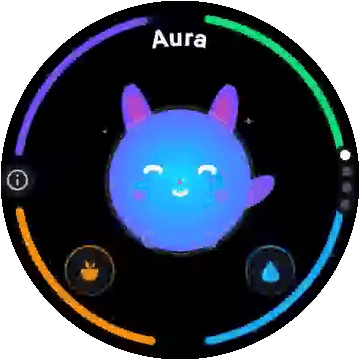

# Thriveling (Wear OS)

[](https://github.com/DunderGG/thriveling/actions/workflows/ci.yml)
[](LICENSE)
-4285F4?logo=wearos&logoColor=white)


A health-mirroring virtual pet companion for Wear OS smartwatches, inspired by the classic Tamagotchi toy. Your companion's vitals (Energy, Hydration, Nutrition, Fitness, and Happiness) directly reflect your real-world habits.

<p align="center">
  
</p>

> [!NOTE]
> **Status: early development.** The core game, passive health sync, and Wear OS surfaces (tile, complications, always-on) are working, while the pet graphics are still open. See the [roadmap](docs/ROADMAP.md). The app is not on the Play Store yet, so you build and install it yourself (see [Getting Started](#-getting-started)).

---

## 🐾 How It Works

Your pet's vitals slowly drop over time. Healthy habits fill them back up:

| You… | Your pet… |
|---|---|
| 🚶 Walk and climb stairs (tracked passively) | gains **Fitness**, **Happiness** and evolution XP, and walks or runs alongside you on screen |
| 💧 Drink water (1 tap on the watch or the tile) | restores **Hydration** |
| 🥗 Log a meal, healthy or not | restores **Nutrition**. Healthy meals also lift **Happiness** |
| 🏃 Get your heart rate up (optional heart-rate sensor) | gains **Fitness** |
| 😴 Keep to a bedtime | sleeps through its night and recovers **Energy** |
| 👆 Tap the pet | purrs, and gains **Happiness** |

Neglect shows too. If hydration or hunger gets critically low, the pet loses happiness faster and a notification reminds you. The pet's mood, evolution stage and archetype all follow from how consistently you look after yourself.

---

## ✨ Key Features
- **Health-Mirroring Game Mechanics**: Steps, floors, heart rate, water and meals feed five vitals, evolution XP and a mood.
- **Battery-Friendly Time-Delta Decay**: Vitals are calculated from timestamps when needed, rather than by continuous CPU wakeups.
- **Wear OS Health Services**: Passively monitors daily steps, floors and heart rate via `PassiveMonitoringClient`.
- **Live Step Reactions**: While the pet screen is open, the pet walks or runs in step with you.
- **Modern Vector-Native Companion**: Dynamic vector rendering with breathing bounce, blinking eyes, blushing cheeks, and mood expressions. The pet sleeps during its night.
- **Round-Screen UI**: A circular multi-vital progress ring (`VitalsRing`), with the rotary crown paging between the pet, a vitals breakdown, today's goals and settings.
- **Daily Goals & Settings**: Set your own goals for steps, water and healthy meals, pick the pet's bedtime, turn vibration on or off, or start over with a new pet.
- **Haptic Feedback**: A purr when petted, a success buzz when you reach a daily goal, a fanfare on evolution, and a tick when a vital fills up.
- **Wear OS Carousel Tile**: Swipe from your watch face to glance at your companion's status, and log a glass of water with one tap.
- **Watch Face Complications**: *Pet Mood* shows the pet's mood and overall health. *Pet Steps* shows today's steps towards your step goal.
- **Critical-Vital Notifications**: A reminder when hydration or hunger gets critically low, never during the pet's night.
- **Always-On**: The pet screen stays visible in a low-power ambient look when your wrist drops.

---

## 🔒 Privacy & Permissions

Everything stays on your watch. The app has no internet permission, no account, and no analytics or ads.

| Permission | Why |
|---|---|
| Physical activity (`ACTIVITY_RECOGNITION`) | Steps and floors |
| Heart rate (`BODY_SENSORS`, or `health.READ_HEART_RATE` on API 36+) | Optional workout signal. The app works without it |
| Notifications (`POST_NOTIFICATIONS`) | Critical-vital reminders |
| Vibration, run at startup | Haptics, and resuming passive tracking after the watch restarts |

---

## 🧰 Tech Stack
- **Platform**: Standalone Wear OS 3.0+ (API 30–36)
- **UI & Rendering**: Jetpack Compose for Wear OS, Wear Material 3, dynamic Compose Canvas
- **Health & Sensors**: AndroidX Health Services (`PassiveMonitoringClient`)
- **Architecture**: Multi-module Clean Architecture + Unidirectional Data Flow (MVI)
- **Persistence & Background**: Jetpack Room SQLite, DataStore Preferences, WorkManager

---

## 🚀 Getting Started

### Prerequisites
- **Android Studio**: Ladybug (2024.2+) or Meerkat (2024.3+)
- **JDK**: OpenJDK 21
- **Android SDK**: API Level 36 (`compileSdk 36`) with Android SDK Platform-Tools
- **Target Device**: Wear OS 3.0+ (API 30+) emulator (round display recommended) or physical smartwatch

### 1. Clone & Open
```bash
git clone https://github.com/DunderGG/thriveling.git
```
Open the repository in **Android Studio**. Gradle will automatically sync dependencies.

### 2. Run on an Emulator
1. Start a **Wear OS emulator** (API 30+ / Wear OS 3.0+) via Android Studio's **Device Manager**.
2. Select the **`wearApp`** run configuration in the top toolbar.
3. Click **Run** (`Shift + F10`).

Alternatively, assemble the debug APK via the command line:
```bash
# macOS / Linux
./gradlew :wearApp:assembleDebug

# Windows
.\gradlew.bat :wearApp:assembleDebug
```
The output APK is generated at `wearApp/build/outputs/apk/debug/wearApp-debug.apk`.

### 3. Install on a Physical Smartwatch (Wireless Debugging)
Most Wear OS smartwatches (Pixel Watch, Galaxy Watch, etc.) connect for development via Wi-Fi:

1. **Enable Developer Options**: On your watch, navigate to **Settings → System → About → Versions** and tap **Build number** 7 times.
2. **Enable Wireless ADB**: Go to **Settings → Developer Options**, and turn on **ADB debugging** and **Wireless debugging**.
3. **Pair & Connect** (ensure your computer and watch share the same Wi-Fi network):
   - Under *Wireless debugging*, tap **Pair new device** to view the IP, port, and pairing code:
     ```bash
     adb pair <watch-ip>:<pairing-port>
     adb connect <watch-ip>:<connect-port>
     ```
4. **Deploy**:
   - Select your watch from Android Studio's device selector dropdown and click **Run** (`Shift + F10`), or:
   - Install the built APK directly via ADB:
     ```bash
     adb install -r wearApp/build/outputs/apk/debug/wearApp-debug.apk
     ```

### 4. Run Unit Tests
Execute the test suite covering mathematical decay, habit logging, and mood calculations:
```bash
# macOS / Linux
./gradlew test

# Windows
.\gradlew.bat test
```

### 5. Simulating Sensors & Verifying on a Watch
Emulators don't walk, so Health Services sensor data has to be simulated. The [Verification Guide](docs/VERIFICATION.md) explains how to do that, and lists the emulator, device and battery checks.

---

## 📚 Documentation

Detailed architectural specifications and development plans are maintained in the [`docs/`](docs/) directory:

- 📖 **[System Architecture](docs/ARCHITECTURE.md)** — PlantUML system flows, module responsibilities, mathematical decay formulas, and source tree.
- ✅ **[Verification Guide](docs/VERIFICATION.md)** — Emulator and watch checks, sensor simulation, and battery profiling.
- 🧭 **[Design Decisions](docs/DESIGN_DECISIONS.md)** — Why the system works the way it does: alternatives, trade-offs, and open questions (highlighted).
- 🔍 **[Reviews](docs/reviews/README.md)** — Dated architecture reviews and their findings (e.g. AR-1 … AR-8).
- 🗺️ **[Project Roadmap](docs/ROADMAP.md)** — 5-phase development roadmap and the **Phase 2b** community naming survey (*Resona*, *Symbio*, *Vitalkin*, *Paravita*, *Vitecho*, *AuraSync*).

---

## 🤝 Contributing

Contributions, bug reports, and ideas are welcome! Please review [CONTRIBUTING.md](CONTRIBUTING.md) for developer setup, code style standards, and the required copyright header for new source files.

---

## 👤 Author

Thriveling • By David Bennehag ([dunder.gg](https://dunder.gg) / [@DunderGG](https://github.com/DunderGG)) • Built with ❤️, 🤖 and ☕

---

## 📄 License

Copyright 2026 DunderGG. Licensed under the [Apache License, Version 2.0](LICENSE). See [NOTICE](NOTICE) for project attributions.
