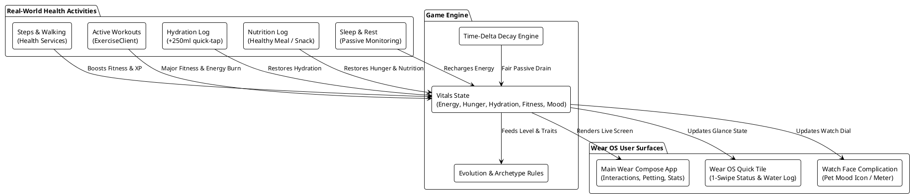
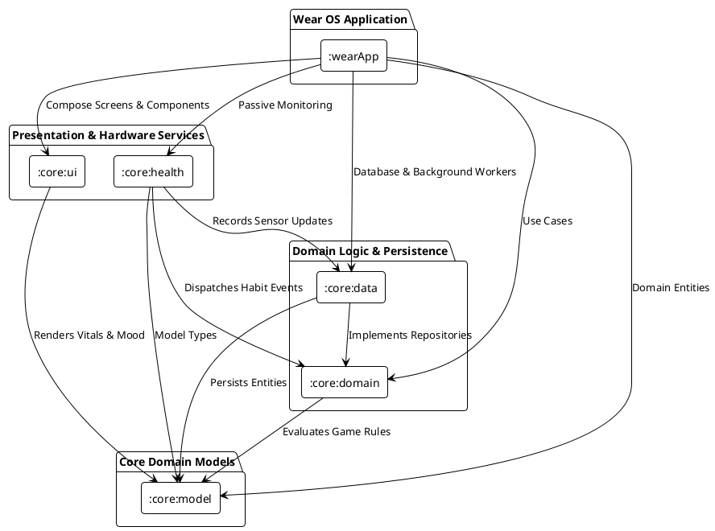
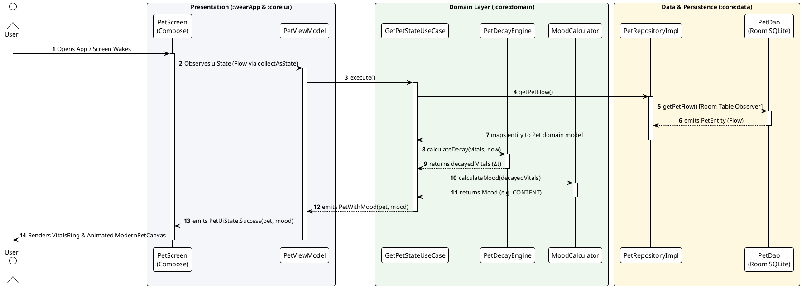
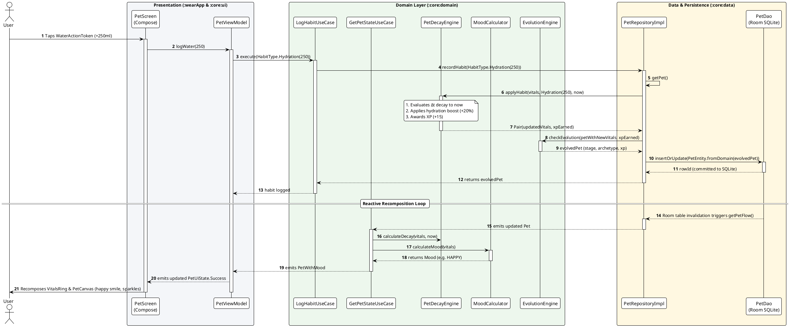
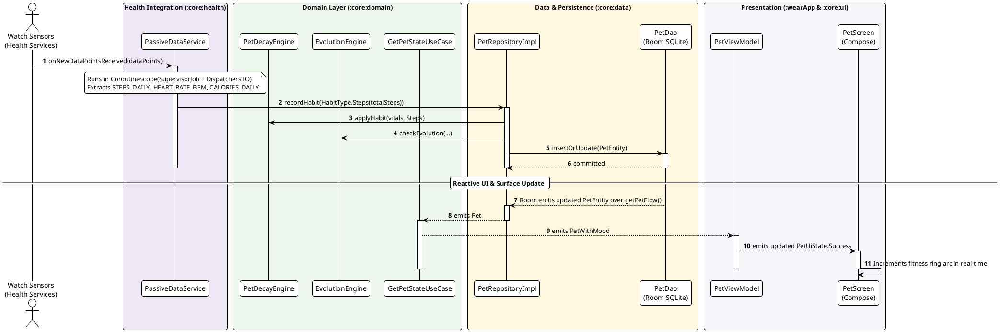
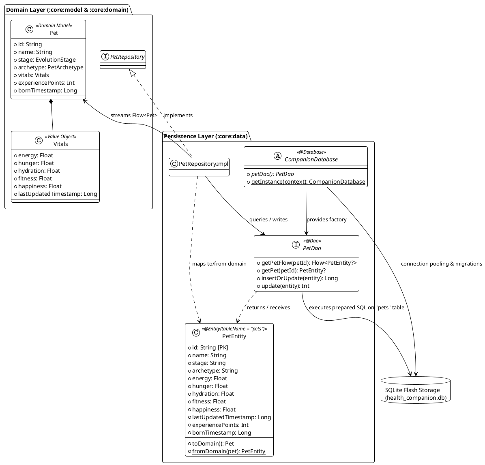

# Architecture & System Design

## Overview
**Health Companion** is a standalone Wear OS virtual pet app inspired by the classic Tamagotchi toy, reimagined for modern smartwatches. The companion's growth, energy, and happiness directly mirror the user's real-world health habits—including physical activity, step goals, hydration, nutrition, and rest.

---

## 1. System Interaction Flow



---

## 2. Technology Stack & Frameworks

| Layer / Component | Technology | Rationale & Capabilities |
| :--- | :--- | :--- |
| **Target Platform** | Wear OS 3.0+ (API 30–36) | Standalone wearable app (`com.google.android.wearable.standalone = true`). |
| **UI Framework** | Jetpack Compose for Wear OS (`compose-material3`, `compose-foundation`) | Hardware-accelerated, declarative UI optimized for circular displays. |
| **Wear Utilities** | Horologist (`horologist-compose-layout`) | Rotary crown input, ambient mode scaffolds, and volume/haptics. |
| **Health & Sensors** | Health Services for Wear OS (`androidx.health:health-services-client`) | Capability-aware passive monitoring via `PassiveMonitoringClient`: steps, heart rate, calories, distance, and floors. |
| **Glance Surfaces** | AndroidX Wear Tiles & ProtoLayout | Instant-access carousel card with 1-tap micro-interactions. |
| **Watch Face Integration** | AndroidX WatchFace Complications | Live mood and vital progress complications on third-party watch faces. |
| **Architecture Pattern** | Clean Architecture + MVI (UDF) | Unidirectional Data Flow with immutable `StateFlow<PetUiState>`. |
| **Persistence** | Jetpack Room SQLite Database | Offline-first local storage for pet vitals, health logs, and history. |
| **Preferences** | Jetpack DataStore Preferences | Lightweight key-value storage for user settings and daily goals. |
| **Background Processing**| Jetpack WorkManager (`work-runtime-ktx`) | Battery-efficient periodic maintenance and midnight daily resets. |

---

## 3. Architectural Pattern: Clean Architecture & MVI (UDF)

The project follows Modern Android Architecture with strict separation of concerns across a multi-module setup:



### Module Responsibilities

1. **[`:wearApp`](../wearApp)**:
   - Standalone Wear OS application entry point (`com.google.android.wearable.standalone = true`).
   - UI orchestration, Wear Navigation, ViewModel bindings.
   - Wear OS surfaces: `PetStatusTileService` (Carousel Tile) and Watch Face Complications.

2. **[`:core:ui`](../core/ui)**:
   - Modern vector-based companion renderer (`ModernPetCanvas`).
   - Dynamic animations: breathing physics, eye blinking, mood facial expressions (Happy, Ecstatic, Hungry, Thirsty, Tired, Sleeping, Grumpy).
   - Circular multi-vital progress ring (`VitalsRing`) designed for round watch dials.
   - Wear Material3 Theme & Color tokens.

3. **[`:core:domain`](../core/domain)**:
   - Pure Kotlin business logic and game mechanics.
   - `PetDecayEngine`: Mathematical timestamp-delta decay calculation.
   - `MoodCalculator`: Evaluates mood states dynamically based on vitals.
   - `EvolutionEngine`: Experience thresholds and archetype branching.
   - Use cases: `GetPetStateUseCase`, `LogHabitUseCase`, `CalculateDecayUseCase`.

4. **[`:core:data`](../core/data)**:
   - Offline-first persistence via Jetpack Room (`CompanionDatabase`, `PetDao`, `PetEntity`).
   - `PetRepositoryImpl`: Coordinates between SQLite database and domain engine.
   - `PetDecayWorker`: Background WorkManager worker for periodic health maintenance.

5. **[`:core:health`](../core/health)**:
   - Wraps Wear OS **Health Services API** (`androidx.health:health-services-client`).
   - `HealthServicesManager`: Queries device capabilities via `getCapabilitiesAsync()` and registers a `PassiveListenerService` for the intersection of desired and supported data types (`STEPS_DAILY`, `HEART_RATE_BPM`, `CALORIES_DAILY`, `DISTANCE_DAILY`, `FLOORS_DAILY`). Gracefully skips unsupported sensors.
   - `PassiveDataService`: Receives OS-batched sensor data and dispatches each type to the appropriate `HabitType` for the game engine. Handles both `IntervalDataType` (steps, calories, distance, floors) and `SampleDataType` (heart rate).

6. **[`:core:model`](../core/model)**:
   - Pure domain models (`Pet`, `Vitals`, `Mood`, `HabitType`, `EvolutionStage`, `PetArchetype`). Zero Android UI dependencies.

### Directory & Source Tree

```
health-companion/
├── build.gradle.kts                      # Root build configuration
├── settings.gradle.kts                   # Multi-module settings
├── gradle/libs.versions.toml             # Version catalog (Compose, Wear, Health, etc.)
│
├── docs/                                 # Project documentation & design specs
│   ├── ARCHITECTURE.md                   # System architecture & PlantUML diagrams
│   └── ROADMAP.md                        # Phased timeline & testing guide
│
├── wearApp/                              # Wear OS Application Module
│   ├── src/main/AndroidManifest.xml      # Standalone watch app configuration
│   └── src/main/java/com/healthcompanion/wear/
│       ├── HealthCompanionApp.kt         # Application setup & WorkManager scheduling
│       ├── MainActivity.kt               # Main Wear ComponentActivity
│       ├── presentation/pet/             # PetScreen, PetViewModel, PetUiState
│       └── tiles/PetStatusTileService.kt # Wear OS Carousel Tile
│
├── core/
│   ├── model/                            # Pure domain models (Pet, Vitals, Mood, Habits)
│   ├── domain/                           # Pure Kotlin game engine & use cases
│   │   ├── engine/PetDecayEngine.kt      # Mathematical decay & habit application
│   │   ├── engine/MoodCalculator.kt      # Dynamic mood evaluation
│   │   └── engine/EvolutionEngine.kt     # Evolution thresholds & archetypes
│   ├── data/                             # Persistence & Repository layer
│   │   ├── db/CompanionDatabase.kt       # Room Database
│   │   ├── repository/PetRepositoryImpl.kt
│   │   └── workers/PetDecayWorker.kt     # Periodic background maintenance
│   ├── health/                           # Wear OS Health Services integration
│   │   ├── HealthServicesManager.kt      # PassiveMonitoringClient wrapper
│   │   └── PassiveDataService.kt         # PassiveListenerService for step counting
│   └── ui/                               # Wear OS Compose UI Components
│       ├── components/ModernPetCanvas.kt # Dynamic vector companion
│       ├── components/VitalsRing.kt      # Circular multi-vital progress arcs
│       └── theme/Theme.kt                # Wear Material3 Dark OLED Palette
```

---

## 4. Component Signal & Interaction Flow (Sequence Diagrams)

To keep the runtime architecture digestible and modular, the end-to-end happy-case lifecycle is decomposed into three distinct sequence flows:
1. **Phase 1: App Startup & Reactive State Observation** (screen wake, decay-on-read, and reactive Compose binding).
2. **Phase 2: User Micro-Interaction** (1-tap quick action, atomic game engine habit integration, and Room SQLite invalidation).
3. **Phase 3: Passive Hardware Sensor Ingestion** (Health Services batched sensor events, conversion to domain habits, and persistence).

---

### 4.1 Phase 1: App Startup & Reactive State Observation

This sequence details what occurs when the user opens the application or the watch screen wakes from ambient mode.



#### Phase 1 Architectural Description
- **Decay-on-Read Pattern**: Rather than running continuous 1-second background ticking loops that would rapidly deplete the watch battery (~300–400 mAh), the database stores vitals as they were at the last write timestamp. When the UI screen wakes and observes the state, `GetPetStateUseCase` lazily evaluates elapsed time decay via `PetDecayEngine.calculateDecay(vitals, now)` based on $\Delta t = \text{currentTimeMillis} - \text{lastUpdatedTimestamp}$.
- **Reactive Stream Composition**:
  1. `PetScreen` subscribes to `PetViewModel.uiState` using Compose's `collectAsState()` delegate.
  2. `PetViewModel` combines the cold stream from `GetPetStateUseCase.execute()` with local petting state into a hot `StateFlow<PetUiState>` using `.stateIn(SharingStarted.WhileSubscribed(5000))`.
  3. `PetDao.getPetFlow()` establishes an SQLite table observer via Room.
  4. `MoodCalculator.calculateMood()` evaluates prioritized rules against the decayed vitals to determine the companion's expression (e.g., Happy, Content, Thirsty, Hungry).
  5. `PetScreen` recomposes the hardware-accelerated `ModernPetCanvas` and `VitalsRing` in the active mood state.

---

### 4.2 Phase 2: User Micro-Interaction (Quick Log Hydration)

This sequence illustrates a typical user micro-interaction: tapping a 1-tap quick action button (e.g., logging +250ml of water).



#### Phase 2 Architectural Description
- **Wearable Micro-Interactions**: Wear OS interactions typically last only 3–5 seconds. Tapping `WaterActionToken` immediately triggers tactile haptic feedback on the wrist via `LocalHapticFeedback` and fires a non-blocking asynchronous coroutine in `viewModelScope`.
- **Atomic Engine Mutation & Progression**:
  1. `PetRepositoryImpl.recordHabit()` first calls `PetDecayEngine.applyHabit()`, which brings vitals up to the current millisecond before applying the habit boost (clamping between `0.0` and `100.0`) and computing earned XP.
  2. `EvolutionEngine.checkEvolution()` checks whether the new XP total crosses stage milestones (e.g., Egg $\rightarrow$ Hatchling $\rightarrow$ Child $\rightarrow$ Teen) and determines archetype specializations (e.g., `Swift Strider`, `Zen Ascetic`).
  3. The evolved pet is flattened into a `PetEntity` and persisted via `PetDao.insertOrUpdate()` with `OnConflictStrategy.REPLACE`.
- **Automatic Reactive Loop Closure**: The write operation does not require manual event dispatching to the UI. Instead, Room's built-in SQLite table invalidation mechanism triggers `PetDao.getPetFlow()`. The fresh entity is automatically emitted through `GetPetStateUseCase`, transformed into a new `PetUiState.Success`, and rendered on the watch face with updated vitals and expressions.

---

### 4.3 Phase 3: Passive Hardware Sensor Ingestion

This sequence illustrates background health tracking via Wear OS Health Services when the user walks or exercises.



#### Phase 3 Architectural Description
- **Hardware-Hub Passive Monitoring**: By registering a `PassiveListenerService` via `PassiveMonitoringClient`, the companion app offloads sensor polling (accelerometer, step detector, PPG heart rate) to the dedicated low-power sensor hardware hub. The application CPU is only woken when the OS delivers batched sensor data.
- **Biometric to Companion Mapping**:
  - `DataType.STEPS_DAILY` $\rightarrow$ mapped to `HabitType.Steps` (restores fitness vital and awards XP proportional to step volume).
  - `DataType.HEART_RATE_BPM` $\rightarrow$ mapped to `HabitType.HeartRate` (evaluates resting vs active cardio zones).
  - `DataType.CALORIES_DAILY` $\rightarrow$ mapped to passive energy burn in `HabitType.Workout`.
  - `DataType.DISTANCE_DAILY` & `DataType.FLOORS_DAILY` $\rightarrow$ converted into equivalent step units.
- **Unified Single Source of Truth**: Because `PassiveDataService` writes directly to Room SQLite via `PetRepositoryImpl`, all user-facing surfaces—including the active `PetScreen`, the carousel `PetStatusTileService`, and watch face complications—automatically receive the updated vitals through their existing database observation streams.

---

### 4.4 Additional Sequence Diagrams for Future Documentation

To keep the primary diagrams manageable and focused on the core runtime loop, the following sequence diagrams represent other operational scenarios that can be added as dedicated reference flows:

1. **Runtime Permission Flow & Graceful Degradation**:
   - `MainActivity` $\rightarrow$ `PermissionViewModel.checkPermissions()` $\rightarrow$ `PermissionScreen` onboarding $\rightarrow$ system permission dialog $\rightarrow$ user denial $\rightarrow$ `PermissionState.Denied` $\rightarrow$ degraded `PetScreen` displaying the `⚠ Enable sensors` chip $\rightarrow$ deep-linking to system Settings and recovery on `ON_RESUME`.
2. **Periodic Background Maintenance (`PetDecayWorker`)**:
   - Android WorkManager 2-hour periodic trigger $\rightarrow$ `PetDecayWorker.doWork()` background execution $\rightarrow$ `CompanionDatabase` singleton access $\rightarrow$ `PetDecayEngine.calculateDecay()` $\rightarrow$ SQLite update $\rightarrow$ `Result.success()` without acquiring wake locks.
3. **Carousel Tile Request & Rendering (`PetStatusTileService`)**:
   - User swipes to Tile on watch face $\rightarrow$ system invokes `TileService.onTileRequest()` $\rightarrow$ `runBlocking` query to `PetRepository` $\rightarrow$ ProtoLayout element tree assembly $\rightarrow$ 10-minute cache freshness declaration $\rightarrow$ `ListenableFuture<Tile>` delivery.
4. **Milestone Evolution & Archetype Specialization**:
   - Cumulative XP crosses stage threshold (e.g. 750 XP for `TEEN`) $\rightarrow$ `EvolutionEngine.checkEvolution()` inspects dominant vitals (e.g. `fitness > 80f`) $\rightarrow$ locks in specialized persona (`CARDIO_RUNNER`) $\rightarrow$ triggers celebratory haptic pattern and visual evolution feedback.
5. **Sensor Capability Negotiation & Hardware Fallback**:
   - `HealthServicesManager.tryRegisterPassiveDataService()` queries `passiveMonitoringClient.getCapabilitiesAsync()` $\rightarrow$ computes intersection with `desiredDataTypes` $\rightarrow$ registers listener only for hardware-supported data types, gracefully skipping missing sensors (e.g. watches without PPG heart rate hardware).

---

## 5. Persistence & Local Storage Architecture (Room & SQLite)

### 5.1 Architectural Overview & Offline-First Strategy

On Wear OS smartwatches, network connectivity is intermittent—wearers leave their phones behind during workouts, Wi-Fi radios sleep to preserve the ~300–400 mAh battery, and cellular (LTE) hardware is either absent or power-prohibitive. Consequently, **Health Companion** employs an **offline-first local persistence architecture**:

1. **Single Source of Truth**: The local SQLite database (`health_companion.db`) is the authoritative source for companion state, vitals, XP, and habit records. No surface or component maintains a diverging in-memory state.
2. **Reactive Observation**: UI screens (`PetScreen`), Carousel Tiles (`PetStatusTileService`), and Watch Face Complications do not poll for data or wait for push notifications. They subscribe directly to the database via reactive Kotlin `Flow` streams. Any write to the database (whether initiated by a button tap or background sensor event) immediately and automatically updates all observing surfaces.
3. **Microscopic Disk Footprint**: Companion state is stored in a normalized, compact table (`pets`). A single primary record (`id = "companion_primary"`) occupies less than 4 KB of flash storage, ensuring sub-millisecond query latency and zero disk pressure on wearable NAND storage.

---

### 5.2 Core Persistence Concepts: Kotlin/Android vs. C++

For developers transitioning from C++, Android's persistence terminology maps directly to familiar native database concepts:

| Term | Android / Kotlin Definition | C++ Equivalent / Native Parallel | Role in Health Companion |
| :--- | :--- | :--- | :--- |
| **SQLite** | An embedded, serverless, transactional SQL engine bundled in the Android OS userland (written in pure C). Operates directly on a local binary file on the device filesystem. | Linking `sqlite3.c` / `libsqlite3.so` directly into a C++ process and calling the raw C API (`sqlite3_open()`, `sqlite3_step()`). | Underpins all persistent storage. The database file is located at `/data/data/com.healthcompanion.wear/databases/health_companion.db`. |
| **ORM** *(Object-Relational Mapping)* | An architectural technique that automatically bridges the impedance mismatch between relational tables (flat scalar columns: `REAL`, `INTEGER`, `TEXT`) and object-oriented memory graphs (nested domain classes, value objects, and enum types). | C++ compile-time ORM libraries such as [`sqlite_orm`](https://github.com/fnc12/sqlite_orm) or [ODB](https://www.codesynthesis.com/products/odb/), or manual struct serialization mapping. | Eliminates manual `Cursor` indexing (e.g. `cursor.getFloat(4)`). Translates relational rows directly to/from `PetEntity`. |
| **Room** | Google's official Android persistence library built on SQLite. It provides compile-time SQL verification, Kotlin Symbol Processing (KSP) code generation, schema migration management, and native Coroutine/Flow streaming. | A compile-time code-generation tool (like Protobuf / FlatBuffers compilers or C++ template metaprogramming) that verifies SQL queries during compilation, generates prepared statements, and handles object deserialization with zero reflection. | Acts as the persistence abstraction layer in `:core:data`. Generates concrete SQLite implementations for DAOs at build time. |
| **DAO** *(Data Access Object)* | An architectural design pattern isolating database interactions behind an abstract interface. The developer declares queries and mutations using annotations (`@Query`, `@Insert`, `@Update`), and the framework generates the underlying SQL execution code. | An abstract C++ interface (`class IPetDao { virtual PetEntity getPet() = 0; ... }`) whose concrete implementation is generated by a preprocessor or code generator. | `PetDao` interface defines all SQL CRUD operations, completely decoupling persistence mechanisms from domain business logic. |

---

### 5.3 The Room Architectural Triad

Room organizes local persistence into three tightly coupled architectural components:



#### 1. The Entity: [`PetEntity.kt`](../core/data/src/main/java/com/healthcompanion/core/data/db/entity/PetEntity.kt)
An `@Entity` class represents a table schema in SQLite. 
- **Flattening Invariant**: The domain model `Pet` contains a nested `Vitals` value object and typed Kotlin enums (`EvolutionStage`, `PetArchetype`). Relational tables cannot natively store nested objects, so `PetEntity` flattens these fields into scalar columns:
  - `vitals.energy` $\rightarrow$ `energy: Float` (`REAL`)
  - `vitals.lastUpdatedTimestamp` $\rightarrow$ `lastUpdatedTimestamp: Long` (`INTEGER`)
  - `stage: EvolutionStage` $\rightarrow$ `stage: String` (`TEXT`)
- **Domain Purity Boundary**: `PetEntity` implements `toDomain(): Pet` and `companion object fromDomain(pet: Pet): PetEntity`. This ensures the domain layer (`:core:model`, `:core:domain`) remains 100% pure Kotlin with zero annotations or imports from Android or Room.

#### 2. The DAO: [`PetDao.kt`](../core/data/src/main/java/com/healthcompanion/core/data/db/dao/PetDao.kt)
The `@Dao` interface declares SQL operations:
- **Reactive Streaming (`getPetFlow`)**:
  ```kotlin
  @Query("SELECT * FROM pets WHERE id = :petId LIMIT 1")
  fun getPetFlow(petId: String = "companion_primary"): Flow<PetEntity?>
  ```
  Returns a cold `Flow`. When collected, Room executes the query on `Dispatchers.IO` and registers an internal table observer.
- **One-Shot Query (`getPet`)**:
  ```kotlin
  @Query("SELECT * FROM pets WHERE id = :petId LIMIT 1")
  suspend fun getPet(petId: String = "companion_primary"): PetEntity?
  ```
  Suspends the calling coroutine until the query completes asynchronously on background I/O.
- **Upsert Mutation (`insertOrUpdate`)**:
  ```kotlin
  @Insert(onConflict = OnConflictStrategy.REPLACE)
  suspend fun insertOrUpdate(pet: PetEntity): Long
  ```
  Executes an atomic SQLite `INSERT OR REPLACE INTO pets` statement, returning the inserted row ID.

#### 3. The Database Provider: [`CompanionDatabase.kt`](../core/data/src/main/java/com/healthcompanion/core/data/db/CompanionDatabase.kt)
Extends `RoomDatabase`, serving as the connection pool manager and factory for DAOs:
- **Thread-Safe Singleton**: Implements the classic double-checked locking idiom with an `@Volatile private var INSTANCE` field (equivalent to C++ memory fences / `std::atomic` and `std::call_once`):
  ```kotlin
  fun getInstance(context: Context): CompanionDatabase {
      return INSTANCE ?: synchronized(this) {
          INSTANCE ?: Room.databaseBuilder(
              context.applicationContext,
              CompanionDatabase::class.java,
              "health_companion.db"
          ).fallbackToDestructiveMigration(dropAllTables = true).build().also { INSTANCE = it }
      }
  }
  ```
- **Context Leak Prevention**: Always invokes `context.applicationContext` so that short-lived Wear activities (`MainActivity`) are never retained in static memory when closed or rotated.

---

### 5.4 Reactive Invalidation Tracker: How Room Powers the UI

The reactive UI update loop in Health Companion works through Room's built-in **`InvalidationTracker`**:

```
[Write Operation]
Sensor Event / User Tap
       │
       ▼
PetDao.insertOrUpdate(entity) ──► SQLite Engine executes UPDATE
                                          │
                                          ▼
                               Room InvalidationTracker
                               (Detects table modification)
                                          │
                                          ▼
                               Re-runs registered SELECT query
                                          │
                                          ▼
PetDao.getPetFlow() ─────────────► Emits fresh PetEntity down Flow
                                          │
                                          ▼
PetRepositoryImpl.getPetFlow() ──► entity.toDomain()
                                          │
                                          ▼
GetPetStateUseCase.execute() ────► Applies Δt decay + calculates Mood
                                          │
                                          ▼
PetViewModel.uiState ────────────► Emits PetUiState.Success
                                          │
                                          ▼
Compose PetScreen ───────────────► Recomposes ModernPetCanvas & VitalsRing
```

#### Under the Hood (C++ Parallel):
1. When `getPetFlow()` is first collected, Room registers a SQLite update hook (similar to `sqlite3_update_hook()` in native C/C++).
2. When any thread modifies the `pets` table (via `insertOrUpdate()` or `update()`), SQLite notifies Room's invalidation tracker.
3. Room's tracker batches table changes and schedules a re-query on a background I/O dispatcher thread.
4. The fresh query result is emitted into the coroutine channel/Flow.
5. Subscribers receive the updated data automatically without requiring manual pub/sub event buses, BroadcastReceivers, or callback registration.

---

### 5.5 Table Schema & Type Mapping

| Domain Field (`Pet`) | Domain Type | Entity Field (`PetEntity`) | SQLite Column | SQLite Affinity | Nullable | Description |
| :--- | :--- | :--- | :--- | :--- | :--- | :--- |
| `id` | `String` | `id` | `id` | `TEXT` | No (PK) | Companion identifier (`"companion_primary"`). |
| `name` | `String` | `name` | `name` | `TEXT` | No | User-assigned companion name (e.g. "Kairo"). |
| `stage` | `EvolutionStage` | `stage` | `stage` | `TEXT` | No | Enum name (`EGG`, `HATCHLING`, `CHILD`, etc.). |
| `archetype` | `PetArchetype` | `archetype` | `archetype` | `TEXT` | No | Enum name (`BALANCED`, `SWIFT_STRIDER`, etc.). |
| `vitals.energy` | `Float` | `energy` | `energy` | `REAL` | No | Energy level `[0.0, 100.0]`. |
| `vitals.hunger` | `Float` | `hunger` | `hunger` | `REAL` | No | Hunger level `[0.0, 100.0]`. |
| `vitals.hydration` | `Float` | `hydration` | `hydration` | `REAL` | No | Hydration level `[0.0, 100.0]`. |
| `vitals.fitness` | `Float` | `fitness` | `fitness` | `REAL` | No | Fitness level `[0.0, 100.0]`. |
| `vitals.happiness` | `Float` | `happiness` | `happiness` | `REAL` | No | Happiness level `[0.0, 100.0]`. |
| `vitals.lastUpdatedTimestamp` | `Long` | `lastUpdatedTimestamp` | `lastUpdatedTimestamp` | `INTEGER` | No | Epoch millisecond timestamp of last write. |
| `experiencePoints` | `Int` | `experiencePoints` | `experiencePoints` | `INTEGER` | No | Cumulative XP earned towards evolution. |
| `bornTimestamp` | `Long` | `bornTimestamp` | `bornTimestamp` | `INTEGER` | No | Epoch millisecond timestamp of pet birth. |

---

## 6. Health Mirroring Game Engine

### Mathematical Time-Delta Decay
To prevent battery drain on Wear OS watches (~300–400 mAh), the game does **not** rely on continuous background ticking. Instead, decay is calculated mathematically on demand:

$$\text{decay} = \frac{\text{currentTime} - \text{lastUpdatedTimestamp}}{3600000} \times \text{decayRatePerHour}$$

| Vital | Range | Hourly Decay | Real-World Restoration Trigger | Effect on Companion |
| :--- | :--- | :--- | :--- | :--- |
| **Fitness / Vitality** | 0–100 | $1.5\% / \text{hr}$ | Steps, heart rate, calories, distance, and floors via `PassiveMonitoringClient`; active workouts | High fitness triggers athletic evolutions and energetic animations |
| **Hydration** | 0–100 | $3.0\% / \text{hr}$ | $+250\text{ml}$ quick tap on watch / Tile | Thirsty pet appears droopy; sends gentle haptic reminder |
| **Hunger / Nutrition**| 0–100 | $2.5\% / \text{hr}$ | Healthy Meal ($+30\%$) / Snack ($+20\%$) | Starving pet refuses to play; well-fed pet smiles and dances |
| **Energy** | 0–100 | $2.0\% / \text{hr}$ | Night sleep and rest periods | Sleepy pet yawns and sleeps when watch is in ambient mode |
| **Happiness**| 0–100 | $2.0\% / \text{hr}$ | Weighted vitals + direct petting/rotary play | Drops if any vital < 20; unlocks tricks, dialogue bubbles, XP |

### Evolution & Archetypes
- **Evolution Stages**: `EGG` (Lv 0) $\rightarrow$ `HATCHLING` (Lv 1, 100 XP) $\rightarrow$ `CHILD` (Lv 2, 300 XP) $\rightarrow$ `TEEN` (Lv 3, 750 XP) $\rightarrow$ `ADULT` (Lv 4, 1500 XP) $\rightarrow$ `ANCIENT_SAGE` (Lv 5, 3000 XP).
- **Habit-Based Archetypes**: At `TEEN` stage, habits determine the pet's persona:
  - *Swift Strider (Cardio)*: High step count consistency.
  - *Zen Ascetic (Mindful)*: High sleep quality and perfect hydration.
  - *Mighty Titan (Strength)*: High workout frequency.
  - *Balanced Soul (Harmony)*: Balanced habits across all vitals.

---

## 7. Runtime Permissions & Degraded Mode

### Required Permissions

The app declares two **dangerous** (runtime) permissions in the Wear OS manifest, plus several **normal** (auto-granted) permissions:

| Permission | Protection Level | Purpose | Module |
| :--- | :--- | :--- | :--- |
| `BODY_SENSORS` | **Dangerous** | Access heart-rate sensor and other on-body biometrics via Health Services | `:core:health` |
| `ACTIVITY_RECOGNITION` | **Dangerous** | Detect step counts, walking, and workout activity via `PassiveMonitoringClient` | `:core:health` |
| `WAKE_LOCK` | Normal | Keep CPU awake during WorkManager background decay processing | `:core:data` |
| `RECEIVE_BOOT_COMPLETED` | Normal | Restart WorkManager tasks and passive listeners after device reboot | `:wearApp` |
| `VIBRATE` | Normal | Haptic feedback on petting, evolution, and goal completion | `:wearApp` |

### Why Runtime Permissions Are Needed

On Android 6.0+ (API 23+), `BODY_SENSORS` and `ACTIVITY_RECOGNITION` are classified as **dangerous permissions** — the OS will not grant them automatically at install time. The app must explicitly request them at runtime via a system dialog, and the user can deny or revoke them at any time through system Settings.

On Wear OS specifically:
- The system permission dialog is shown directly on the watch (no phone companion involved, since this is a standalone app).
- After the user taps **"Deny"** twice for the same permission, the system sets a **"Don't ask again"** flag. Subsequent calls to `requestPermissions()` will return an immediate denial without showing a dialog. The only recovery path is for the user to manually toggle the permission in **Settings → Apps → Health Companion → Permissions**.
- `shouldShowRequestPermissionRationale()` returns `false` in two cases: (1) the permission has never been requested, and (2) the user selected "Don't ask again." We distinguish these by tracking whether a request has been launched.

### Design Philosophy: Graceful Degradation

The app follows a **degraded mode** strategy rather than blocking the user behind a permission wall:

1. **First launch**: A lightweight `PermissionScreen` explains why sensor access is needed and presents an "Allow" button. This is the only time the app proactively interrupts the user.
2. **Permission granted**: The app enters **full mode** — passive step tracking registers via `HealthServicesManager`, and the companion's fitness vital reflects real-world activity.
3. **Permission denied**: The app enters **degraded mode** — `PetScreen` renders normally with all manual features functional (water, meals, petting), but a subtle `⚠ Enable sensors` chip appears above the companion name. Tapping the chip opens the system's app permission settings. Step tracking remains inactive.
4. **Permission re-granted** (via Settings): When the user returns from Settings, `MainActivity` re-checks permissions on `ON_RESUME` and silently transitions to full mode, registering the passive listener.

This ensures the app is **always usable** — the virtual pet can still be fed, hydrated, and petted without sensor data. Sensor permissions enhance the experience but are not a hard gate.

### Implementation Architecture

```
MainActivity (ON_RESUME)
  └── PermissionViewModel
        ├── checkPermissions() ←── HealthPermissions.hasPermissions(context)
        ├── onPermissionResult(grants, shouldShowRationale)
        │     ├── all granted → PermissionState.Granted → registerPassiveDataService()
        │     └── any denied  → PermissionState.Denied  → degraded mode
        └── permissionState: StateFlow<PermissionState>
              └── observed by MainActivity setContent { when(permState) { ... } }
```

| File | Responsibility |
| :--- | :--- |
| [`HealthPermissions.kt`](../core/health/src/main/java/com/healthcompanion/core/health/HealthPermissions.kt) | Defines `REQUIRED_PERMISSIONS` array and `hasPermissions(context)` check |
| [`PermissionState.kt`](../wearApp/src/main/java/com/healthcompanion/wear/presentation/permission/PermissionState.kt) | Sealed interface: `Checking`, `Required`, `Granted`, `Denied` |
| [`PermissionViewModel.kt`](../wearApp/src/main/java/com/healthcompanion/wear/presentation/permission/PermissionViewModel.kt) | Orchestrates permission checks, result callbacks, and Health Services registration |
| [`PermissionScreen.kt`](../wearApp/src/main/java/com/healthcompanion/wear/presentation/permission/PermissionScreen.kt) | Compact onboarding UI with sensor icon, explanation, and "Allow" button |
| [`MainActivity.kt`](../wearApp/src/main/java/com/healthcompanion/wear/MainActivity.kt) | Hosts `RequestMultiplePermissions` launcher and routes between screens |

---

## 8. Wear OS Performance & Battery Best Practices
- **Passive Health Services**: Using `PassiveMonitoringClient` delegates sensor polling to the OS hardware hub, consuming near-zero extra battery.
- **Pure Vector UI**: All companion graphics are drawn via hardware-accelerated Compose Canvas paths, eliminating large bitmap assets from memory.
- **Ambient Mode Compatible**: Pure black OLED backgrounds (`#0A0E14`) maximize battery preservation.
- **Micro-Interactions**: Wear OS users interact in 3-to-5-second bursts. The Carousel Tile and 1-tap quick action buttons allow logging without deep navigation.
