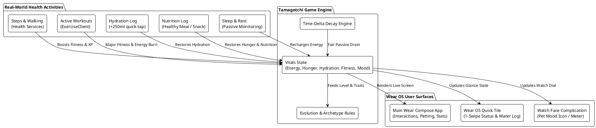
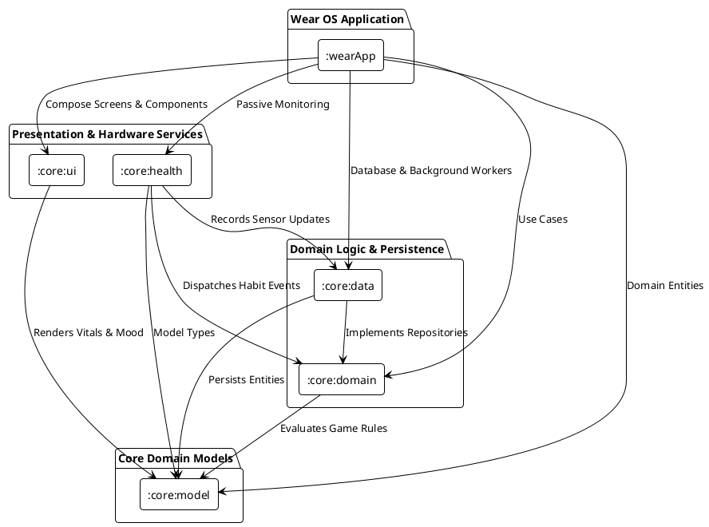

# Architecture & System Design

## Overview
**Health Companion** is a standalone Wear OS virtual pet app inspired by the classic Tamagotchi toy, reimagined for modern smartwatches. The companion's growth, energy, and happiness directly mirror the user's real-world health habits—including physical activity, step goals, hydration, nutrition, and rest.

---

## 1. System Interaction Flow



---

## 2. Technology Stack & Frameworks

| Layer / Component | Technology | Rationale & Capabilities |
| :--- | :--- | :--- |
| **Target Platform** | Wear OS 3.0+ (API 30–36) | Standalone wearable app (`com.google.android.wearable.standalone = true`). |
| **UI Framework** | Jetpack Compose for Wear OS (`compose-material3`, `compose-foundation`) | Hardware-accelerated, declarative UI optimized for circular displays. |
| **Wear Utilities** | Horologist (`horologist-compose-layout`) | Rotary crown input, ambient mode scaffolds, and volume/haptics. |
| **Health & Sensors** | Health Services for Wear OS (`androidx.health:health-services-client`) | Passive step counting via `PassiveMonitoringClient` and `PassiveListenerService`. |
| **Glance Surfaces** | AndroidX Wear Tiles & ProtoLayout | Instant-access carousel card with 1-tap micro-interactions. |
| **Watch Face Integration** | AndroidX WatchFace Complications | Live mood and vital progress complications on third-party watch faces. |
| **Architecture Pattern** | Clean Architecture + MVI (UDF) | Unidirectional Data Flow with immutable `StateFlow<PetUiState>`. |
| **Persistence** | Jetpack Room SQLite Database | Offline-first local storage for pet vitals, health logs, and history. |
| **Preferences** | Jetpack DataStore Preferences | Lightweight key-value storage for user settings and daily goals. |
| **Background Processing**| Jetpack WorkManager (`work-runtime-ktx`) | Battery-efficient periodic maintenance and midnight daily resets. |

---

## 3. Architectural Pattern: Clean Architecture & MVI (UDF)

The project follows Modern Android Architecture with strict separation of concerns across a multi-module setup:



### Module Responsibilities

1. **[`:wearApp`](../wearApp)**:
   - Standalone Wear OS application entry point (`com.google.android.wearable.standalone = true`).
   - UI orchestration, Wear Navigation, ViewModel bindings.
   - Wear OS surfaces: `PetStatusTileService` (Carousel Tile) and Watch Face Complications.

2. **[`:core:ui`](../core/ui)**:
   - Modern vector-based companion renderer (`ModernPetCanvas`).
   - Dynamic animations: breathing physics, eye blinking, mood facial expressions (Happy, Ecstatic, Hungry, Thirsty, Tired, Sleeping, Grumpy).
   - Circular multi-vital progress ring (`VitalsRing`) designed for round watch dials.
   - Wear Material3 Theme & Color tokens.

3. **[`:core:domain`](../core/domain)**:
   - Pure Kotlin business logic and game mechanics.
   - `PetDecayEngine`: Mathematical timestamp-delta decay calculation.
   - `MoodCalculator`: Evaluates mood states dynamically based on vitals.
   - `EvolutionEngine`: Experience thresholds and archetype branching.
   - Use cases: `GetPetStateUseCase`, `LogHabitUseCase`, `CalculateDecayUseCase`.

4. **[`:core:data`](../core/data)**:
   - Offline-first persistence via Jetpack Room (`CompanionDatabase`, `PetDao`, `PetEntity`).
   - `PetRepositoryImpl`: Coordinates between SQLite database and domain engine.
   - `PetDecayWorker`: Background WorkManager worker for periodic health maintenance.

5. **[`:core:health`](../core/health)**:
   - Wraps Wear OS **Health Services API** (`androidx.health:health-services-client`).
   - `PassiveMonitoringClient`: Subscribes to daily step counts and passive goals without active battery drain.
   - `PassiveDataService`: Listens for OS-batched step updates and applies them to the companion.

6. **[`:core:model`](../core/model)**:
   - Pure domain models (`Pet`, `Vitals`, `Mood`, `HabitType`, `EvolutionStage`, `PetArchetype`). Zero Android UI dependencies.

### Directory & Source Tree

```
health-companion/
├── build.gradle.kts                      # Root build configuration
├── settings.gradle.kts                   # Multi-module settings
├── gradle/libs.versions.toml             # Version catalog (Compose, Wear, Health, etc.)
│
├── docs/                                 # Project documentation & design specs
│   ├── ARCHITECTURE.md                   # System architecture & PlantUML diagrams
│   └── ROADMAP.md                        # Phased timeline & testing guide
│
├── wearApp/                              # Wear OS Application Module
│   ├── src/main/AndroidManifest.xml      # Standalone watch app configuration
│   └── src/main/java/com/healthcompanion/wear/
│       ├── HealthCompanionApp.kt         # Application setup & WorkManager scheduling
│       ├── MainActivity.kt               # Main Wear ComponentActivity
│       ├── presentation/pet/             # PetScreen, PetViewModel, PetUiState
│       └── tiles/PetStatusTileService.kt # Wear OS Carousel Tile
│
├── core/
│   ├── model/                            # Pure domain models (Pet, Vitals, Mood, Habits)
│   ├── domain/                           # Pure Kotlin game engine & use cases
│   │   ├── engine/PetDecayEngine.kt      # Mathematical decay & habit application
│   │   ├── engine/MoodCalculator.kt      # Dynamic mood evaluation
│   │   └── engine/EvolutionEngine.kt     # Evolution thresholds & archetypes
│   ├── data/                             # Persistence & Repository layer
│   │   ├── db/CompanionDatabase.kt       # Room Database
│   │   ├── repository/PetRepositoryImpl.kt
│   │   └── workers/PetDecayWorker.kt     # Periodic background maintenance
│   ├── health/                           # Wear OS Health Services integration
│   │   ├── HealthServicesManager.kt      # PassiveMonitoringClient wrapper
│   │   └── PassiveDataService.kt         # PassiveListenerService for step counting
│   └── ui/                               # Wear OS Compose UI Components
│       ├── components/ModernPetCanvas.kt # Dynamic vector companion
│       ├── components/VitalsRing.kt      # Circular multi-vital progress arcs
│       └── theme/Theme.kt                # Wear Material3 Dark OLED Palette
```

---

## 4. Health Mirroring Game Engine

### Mathematical Time-Delta Decay
To prevent battery drain on Wear OS watches (~300–400 mAh), the game does **not** rely on continuous background ticking. Instead, decay is calculated mathematically on demand:

$$\text{decay} = \frac{\text{currentTime} - \text{lastUpdatedTimestamp}}{3600000} \times \text{decayRatePerHour}$$

| Vital | Range | Hourly Decay | Real-World Restoration Trigger | Effect on Companion |
| :--- | :--- | :--- | :--- | :--- |
| **Fitness / Vitality** | 0–100 | $1.5\% / \text{hr}$ | Step tracking via `PassiveMonitoringClient` & active workouts | High fitness triggers athletic evolutions and energetic animations |
| **Hydration** | 0–100 | $3.0\% / \text{hr}$ | $+250\text{ml}$ quick tap on watch / Tile | Thirsty pet appears droopy; sends gentle haptic reminder |
| **Hunger / Nutrition**| 0–100 | $2.5\% / \text{hr}$ | Healthy Meal ($+30\%$) / Snack ($+20\%$) | Starving pet refuses to play; well-fed pet smiles and dances |
| **Energy** | 0–100 | $2.0\% / \text{hr}$ | Night sleep and rest periods | Sleepy pet yawns and sleeps when watch is in ambient mode |
| **Happiness**| 0–100 | $2.0\% / \text{hr}$ | Weighted vitals + direct petting/rotary play | Drops if any vital < 20; unlocks tricks, dialogue bubbles, XP |

### Evolution & Archetypes
- **Evolution Stages**: `EGG` (Lv 0) $\rightarrow$ `HATCHLING` (Lv 1, 100 XP) $\rightarrow$ `CHILD` (Lv 2, 300 XP) $\rightarrow$ `TEEN` (Lv 3, 750 XP) $\rightarrow$ `ADULT` (Lv 4, 1500 XP) $\rightarrow$ `ANCIENT_SAGE` (Lv 5, 3000 XP).
- **Habit-Based Archetypes**: At `TEEN` stage, habits determine the pet's persona:
  - *Swift Strider (Cardio)*: High step count consistency.
  - *Zen Ascetic (Mindful)*: High sleep quality and perfect hydration.
  - *Mighty Titan (Strength)*: High workout frequency.
  - *Balanced Soul (Harmony)*: Balanced habits across all vitals.

---

## 5. Runtime Permissions & Degraded Mode

### Required Permissions

The app declares two **dangerous** (runtime) permissions in the Wear OS manifest, plus several **normal** (auto-granted) permissions:

| Permission | Protection Level | Purpose | Module |
| :--- | :--- | :--- | :--- |
| `BODY_SENSORS` | **Dangerous** | Access heart-rate sensor and other on-body biometrics via Health Services | `:core:health` |
| `ACTIVITY_RECOGNITION` | **Dangerous** | Detect step counts, walking, and workout activity via `PassiveMonitoringClient` | `:core:health` |
| `WAKE_LOCK` | Normal | Keep CPU awake during WorkManager background decay processing | `:core:data` |
| `RECEIVE_BOOT_COMPLETED` | Normal | Restart WorkManager tasks and passive listeners after device reboot | `:wearApp` |
| `VIBRATE` | Normal | Haptic feedback on petting, evolution, and goal completion | `:wearApp` |

### Why Runtime Permissions Are Needed

On Android 6.0+ (API 23+), `BODY_SENSORS` and `ACTIVITY_RECOGNITION` are classified as **dangerous permissions** — the OS will not grant them automatically at install time. The app must explicitly request them at runtime via a system dialog, and the user can deny or revoke them at any time through system Settings.

On Wear OS specifically:
- The system permission dialog is shown directly on the watch (no phone companion involved, since this is a standalone app).
- After the user taps **"Deny"** twice for the same permission, the system sets a **"Don't ask again"** flag. Subsequent calls to `requestPermissions()` will return an immediate denial without showing a dialog. The only recovery path is for the user to manually toggle the permission in **Settings → Apps → Health Companion → Permissions**.
- `shouldShowRequestPermissionRationale()` returns `false` in two cases: (1) the permission has never been requested, and (2) the user selected "Don't ask again." We distinguish these by tracking whether a request has been launched.

### Design Philosophy: Graceful Degradation

The app follows a **degraded mode** strategy rather than blocking the user behind a permission wall:

1. **First launch**: A lightweight `PermissionScreen` explains why sensor access is needed and presents an "Allow" button. This is the only time the app proactively interrupts the user.
2. **Permission granted**: The app enters **full mode** — passive step tracking registers via `HealthServicesManager`, and the companion's fitness vital reflects real-world activity.
3. **Permission denied**: The app enters **degraded mode** — `PetScreen` renders normally with all manual features functional (water, meals, petting), but a subtle `⚠ Enable sensors` chip appears above the companion name. Tapping the chip opens the system's app permission settings. Step tracking remains inactive.
4. **Permission re-granted** (via Settings): When the user returns from Settings, `MainActivity` re-checks permissions on `ON_RESUME` and silently transitions to full mode, registering the passive listener.

This ensures the app is **always usable** — the virtual pet can still be fed, hydrated, and petted without sensor data. Sensor permissions enhance the experience but are not a hard gate.

### Implementation Architecture

```
MainActivity (ON_RESUME)
  └── PermissionViewModel
        ├── checkPermissions() ←── HealthPermissions.hasPermissions(context)
        ├── onPermissionResult(grants, shouldShowRationale)
        │     ├── all granted → PermissionState.Granted → registerPassiveDataService()
        │     └── any denied  → PermissionState.Denied  → degraded mode
        └── permissionState: StateFlow<PermissionState>
              └── observed by MainActivity setContent { when(permState) { ... } }
```

| File | Responsibility |
| :--- | :--- |
| [`HealthPermissions.kt`](../core/health/src/main/java/com/healthcompanion/core/health/HealthPermissions.kt) | Defines `REQUIRED_PERMISSIONS` array and `hasPermissions(context)` check |
| [`PermissionState.kt`](../wearApp/src/main/java/com/healthcompanion/wear/presentation/permission/PermissionState.kt) | Sealed interface: `Checking`, `Required`, `Granted`, `Denied` |
| [`PermissionViewModel.kt`](../wearApp/src/main/java/com/healthcompanion/wear/presentation/permission/PermissionViewModel.kt) | Orchestrates permission checks, result callbacks, and Health Services registration |
| [`PermissionScreen.kt`](../wearApp/src/main/java/com/healthcompanion/wear/presentation/permission/PermissionScreen.kt) | Compact onboarding UI with sensor icon, explanation, and "Allow" button |
| [`MainActivity.kt`](../wearApp/src/main/java/com/healthcompanion/wear/MainActivity.kt) | Hosts `RequestMultiplePermissions` launcher and routes between screens |

---

## 6. Wear OS Performance & Battery Best Practices
- **Passive Health Services**: Using `PassiveMonitoringClient` delegates sensor polling to the OS hardware hub, consuming near-zero extra battery.
- **Pure Vector UI**: All companion graphics are drawn via hardware-accelerated Compose Canvas paths, eliminating large bitmap assets from memory.
- **Ambient Mode Compatible**: Pure black OLED backgrounds (`#0A0E14`) maximize battery preservation.
- **Micro-Interactions**: Wear OS users interact in 3-to-5-second bursts. The Carousel Tile and 1-tap quick action buttons allow logging without deep navigation.
