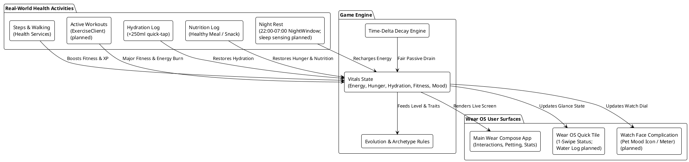
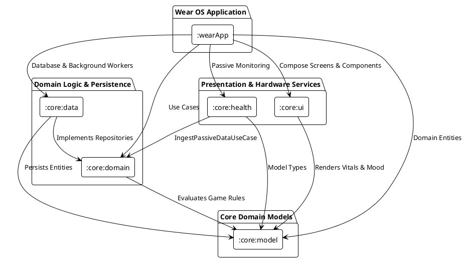
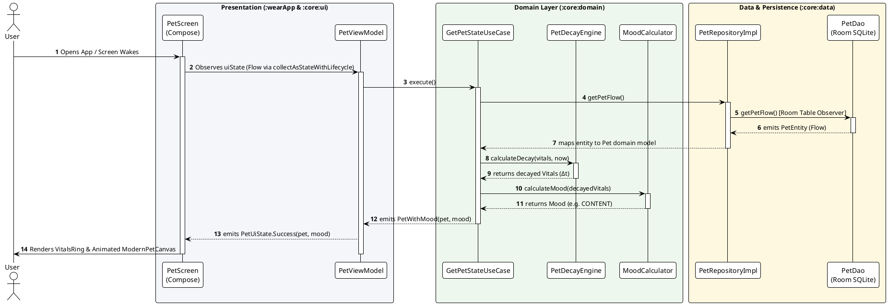
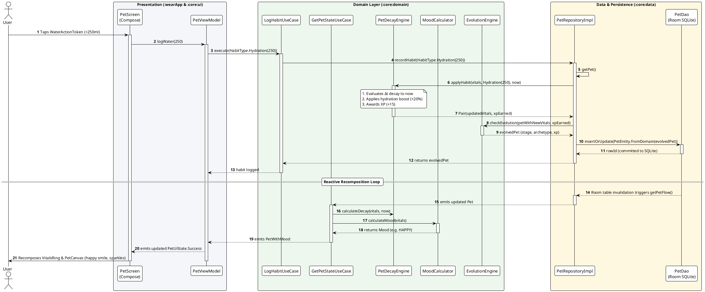
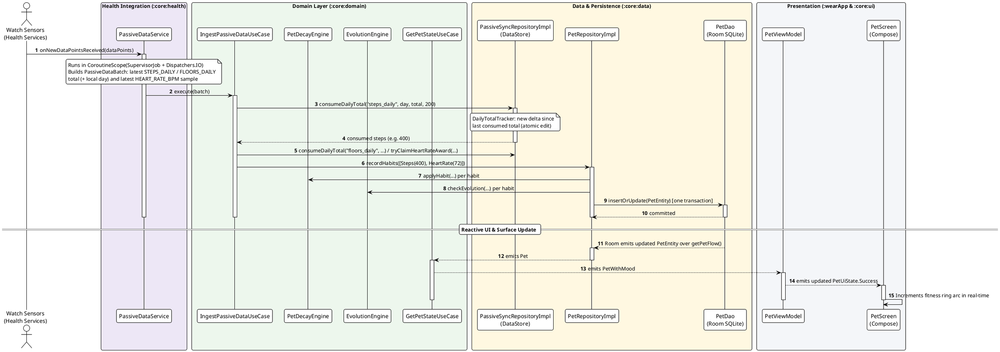
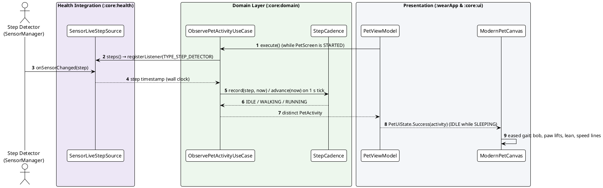
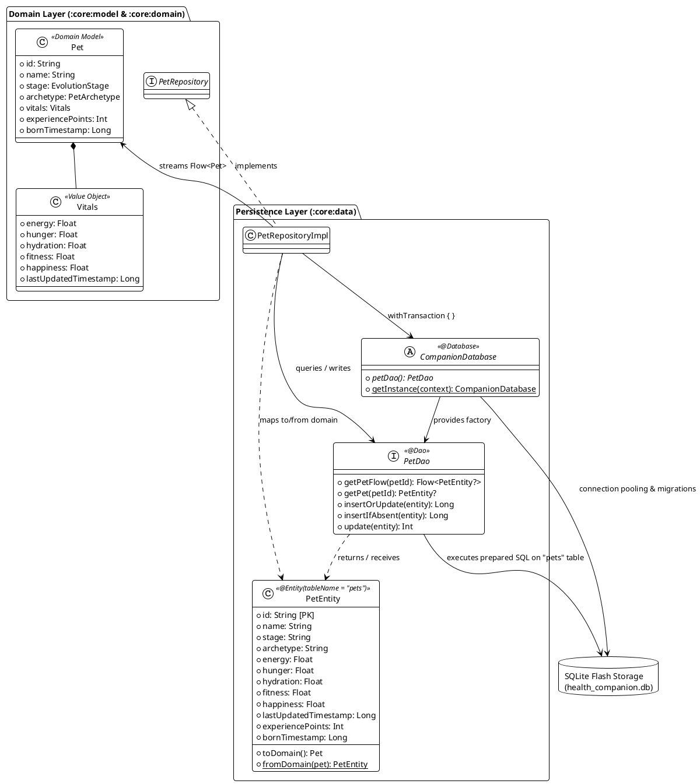

# Architecture & System Design

## Overview
**Health Companion** is a standalone Wear OS virtual pet app inspired by the classic Tamagotchi toy, reimagined for modern smartwatches. The companion's growth, energy, and happiness directly mirror the user's real-world health habits—including physical activity, step goals, hydration, nutrition, and rest.

> **Document status (2026-09-26):** This document describes both the implemented system and the target design. Items marked *(planned)* do not exist in code yet. Known deviations between the design and the current implementation are tracked as numbered review findings (**AR-1 … AR-8**) in [reviews/2026-09-26-architecture-review.md](reviews/2026-09-26-architecture-review.md) (all reviews: [reviews/](reviews/README.md)) and scheduled in [ROADMAP.md → Phase 2a](ROADMAP.md#phase-2a-architecture-review-remediation). The reasoning behind non-trivial design choices, their trade-offs and open questions is logged separately in [DESIGN_DECISIONS.md](DESIGN_DECISIONS.md) (**DD-xx**).

---

## 1. System Interaction Flow


```plantuml
@startuml System_Interaction_Flow
!theme plain
skinparam componentStyle rectangle
skinparam roundCorner 8

package "Real-World Health Activities" as RealWorld {
    [Steps & Walking\n(Health Services)] as Steps
    [Active Workouts\n(ExerciseClient)\n(planned)] as Workouts
    [Hydration Log\n(+250ml quick-tap)] as Water
    [Nutrition Log\n(Healthy Meal / Snack)] as Food
    [Night Rest\n(22:00–07:00 NightWindow;\nsleep sensing planned)] as Sleep
}

package "Game Engine" as PetEngine {
    [Time-Delta Decay Engine] as Decay
    [Vitals State\n(Energy, Hunger, Hydration, Fitness, Mood)] as Vitals
    [Evolution & Archetype Rules] as Evo
}

package "Wear OS User Surfaces" as WearSurfaces {
    [Main Wear Compose App\n(Interactions, Petting, Stats)] as MainApp
    [Wear OS Quick Tile\n(1-Swipe Status;\nWater Log planned)] as Tile
    [Watch Face Complication\n(Pet Mood Icon / Meter)\n(planned)] as Complication
}

Steps --> Vitals : Boosts Fitness & XP
Workouts --> Vitals : Major Fitness & Energy Burn
Water --> Vitals : Restores Hydration
Food --> Vitals : Restores Hunger & Nutrition
Sleep --> Vitals : Recharges Energy
Decay --> Vitals : Fair Passive Drain

Vitals --> Evo : Feeds Level & Traits
Vitals --> MainApp : Renders Live Screen
Vitals --> Tile : Updates Glance State
Vitals --> Complication : Updates Watch Dial
@enduml
```

---

## 2. Technology Stack & Frameworks

| Layer / Component | Technology | Rationale & Capabilities |
| :--- | :--- | :--- |
| **Target Platform** | Wear OS 3.0+ (API 30–36) | Standalone wearable app (`com.google.android.wearable.standalone = true`). |
| **UI Framework** | Jetpack Compose for Wear OS (`compose-material3`, `compose-foundation`) | Hardware-accelerated, declarative UI optimized for circular displays. |
| **Wear Utilities** | Horologist (`horologist-compose-layout`) | Rotary crown input, ambient mode scaffolds, and volume/haptics. |
| **Health & Sensors** | Health Services for Wear OS (`androidx.health:health-services-client`) | Capability-aware passive monitoring via `PassiveMonitoringClient`: steps, floors, and heart rate. |
| **Glance Surfaces** | AndroidX Wear Tiles & ProtoLayout | Instant-access carousel card with 1-tap micro-interactions. |
| **Watch Face Integration** | AndroidX WatchFace Complications | *(planned — dependency declared, no data source service yet)* Live mood and vital progress complications on third-party watch faces. |
| **Architecture Pattern** | Clean Architecture + MVI (UDF) | Unidirectional Data Flow with immutable `StateFlow<PetUiState>`. |
| **Persistence** | Jetpack Room SQLite Database | Offline-first local storage for pet vitals, health logs, and history. |
| **Preferences** | Jetpack DataStore Preferences | *(planned — dependency declared, not yet used)* Lightweight key-value storage for user settings and daily goals. |
| **Background Processing**| Jetpack WorkManager (`work-runtime-ktx`) | One-time re-registration of passive monitoring after boot (`PassiveRegistrationWorker`). No periodic work: decay is computed on read (AR-5). |

---

## 3. Architectural Pattern: Clean Architecture & MVI (UDF)

The project follows Modern Android Architecture with strict separation of concerns across a multi-module setup:


```plantuml
@startuml Module_Architecture
!theme plain
skinparam componentStyle rectangle
skinparam roundCorner 8

package "Wear OS Application" {
    [:wearApp] as wearApp
}

package "Presentation & Hardware Services" {
    [:core:ui] as coreUi
    [:core:health] as coreHealth
}

package "Domain Logic & Persistence" {
    [:core:domain] as coreDomain
    [:core:data] as coreData
}

package "Core Domain Models" {
    [:core:model] as coreModel
}

wearApp --> coreUi : Compose Screens & Components
wearApp --> coreHealth : Passive Monitoring
wearApp --> coreDomain : Use Cases
wearApp --> coreData : Database & Background Workers
wearApp --> coreModel : Domain Entities

coreUi --> coreModel : Renders Vitals & Mood
coreHealth --> coreDomain : IngestPassiveDataUseCase
coreHealth --> coreModel : Model Types

coreData --> coreDomain : Implements Repositories
coreData --> coreModel : Persists Entities

coreDomain --> coreModel : Evaluates Game Rules
@enduml
```

### Module Responsibilities

1. **[`:wearApp`](../wearApp)**:
   - Standalone Wear OS application entry point (`com.google.android.wearable.standalone = true`).
   - UI orchestration, Wear Navigation, ViewModel bindings.
   - Composition root: `AppContainer` builds the single dependency graph (clock, database, repositories, use cases, `HealthServicesManager`). `HealthCompanionApp` owns it and implements `PassiveDataDependencies` for `:core:health`.
   - Wear OS surfaces: `PetStatusTileService` (Carousel Tile) and Watch Face Complications *(planned)*.

2. **[`:core:ui`](../core/ui)**:
   - Modern vector-based companion renderer (`ModernPetCanvas`).
   - Dynamic animations: breathing physics, eye blinking, mood facial expressions (Happy, Ecstatic, Hungry, Thirsty, Tired, Sleeping, Grumpy).
   - Live gait (`PetActivity`): a bobbing trot with alternating paws when walking, a forward lean with speed lines when running.
   - Circular multi-vital progress ring (`VitalsRing`) designed for round watch dials.
   - Wear Material3 Theme & Color tokens.

3. **[`:core:domain`](../core/domain)**:
   - Pure Kotlin business logic and game mechanics.
   - `PetDecayEngine`: Mathematical timestamp-delta decay calculation.
   - `MoodCalculator`: Evaluates mood states dynamically based on vitals.
   - `EvolutionEngine`: Experience thresholds and archetype branching.
   - `DailyTotalTracker`: Converts cumulative daily sensor totals into apply-once deltas.
   - `NightWindow`: The pet's local-time night (22:00–07:00): energy recovery and the `SLEEPING` mood.
   - `ArchetypeSelector`: Picks the archetype from 7-day habit consistency when the pet reaches `TEEN`.
   - `StepCadence`: Turns live step timestamps into `IDLE` / `WALKING` / `RUNNING` (burst cadence with hysteresis).
   - Use cases: `GetPetStateUseCase`, `LogHabitUseCase`, `IngestPassiveDataUseCase`, `ObservePetActivityUseCase`.
   - Repository interfaces: `PetRepository`, `PassiveSyncRepository`. Sensor interface: `LiveStepSource`.

4. **[`:core:data`](../core/data)**:
   - Offline-first persistence via Jetpack Room (`CompanionDatabase`, `PetDao`, `PetEntity`).
   - `PetRepositoryImpl`: Coordinates between SQLite database and domain engine.
   - `PassiveSyncRepositoryImpl`: DataStore-backed bookkeeping of consumed sensor totals and heart-rate award timing.

5. **[`:core:health`](../core/health)**:
   - Wraps Wear OS **Health Services API** (`androidx.health:health-services-client`).
   - `HealthServicesManager`: Queries device capabilities via `getCapabilitiesAsync()` and registers a `PassiveListenerService` for the intersection of desired and supported data types (`STEPS_DAILY`, `FLOORS_DAILY`, `HEART_RATE_BPM`). Gracefully skips unsupported sensors.
   - `PassiveDataService`: Receives OS-batched sensor data, extracts the latest daily totals (`IntervalDataType`, tagged with their local day) and the latest heart-rate sample (`SampleDataType`) into a `PassiveDataBatch`, and hands it to `IngestPassiveDataUseCase`.
   - `SensorLiveStepSource`: Foreground-only live steps from the platform step detector (step-counter fallback via `StepCounterSpreader`) for cosmetic pet reactions (§4.4).
   - Depends only on `:core:domain`. `PassiveDataService` obtains `IngestPassiveDataUseCase` through the `PassiveDataDependencies` interface, which the `Application` implements.

6. **[`:core:model`](../core/model)**:
   - Pure domain models (`Pet`, `Vitals`, `Mood`, `PetActivity`, `HabitType`, `EvolutionStage`, `PetArchetype`). Zero Android UI dependencies.

### Directory & Source Tree

```
health-companion/
├── build.gradle.kts                      # Root build configuration
├── settings.gradle.kts                   # Multi-module settings
├── gradle/libs.versions.toml             # Version catalog (Compose, Wear, Health, etc.)
│
├── docs/                                 # Project documentation & design specs
│   ├── ARCHITECTURE.md                   # System architecture & PlantUML diagrams
│   ├── DESIGN_DECISIONS.md               # Decision log (DD-xx): rationale, trade-offs, open questions
│   ├── reviews/                         # Dated point-in-time reviews (findings AR-x, …)
│   └── ROADMAP.md                        # Phased timeline & testing guide
│
├── wearApp/                              # Wear OS Application Module
│   ├── src/main/AndroidManifest.xml      # Standalone watch app configuration
│   └── src/main/java/com/healthcompanion/wear/
│       ├── HealthCompanionApp.kt         # Application: owns AppContainer, WorkManager scheduling
│       ├── AppContainer.kt               # Composition root (manual DI)
│       ├── MainActivity.kt               # Main Wear ComponentActivity
│       ├── presentation/pet/             # PetScreen, PetViewModel, PetUiState
│       └── tiles/PetStatusTileService.kt # Wear OS Carousel Tile
│
├── core/
│   ├── model/                            # Pure domain models (Pet, Vitals, Mood, Habits)
│   ├── domain/                           # Pure Kotlin game engine & use cases
│   │   ├── engine/PetDecayEngine.kt      # Mathematical decay & habit application
│   │   ├── engine/MoodCalculator.kt      # Dynamic mood evaluation
│   │   ├── engine/EvolutionEngine.kt     # Evolution thresholds & archetypes
│   │   └── engine/StepCadence.kt         # Live walk/run detection from step timestamps
│   ├── data/                             # Persistence & Repository layer
│   │   ├── db/CompanionDatabase.kt       # Room Database
│   │   ├── repository/PetRepositoryImpl.kt
│   ├── health/                           # Wear OS Health Services integration
│   │   ├── HealthServicesManager.kt      # PassiveMonitoringClient wrapper
│   │   ├── PassiveDataService.kt         # PassiveListenerService: parses sensor batches
│   │   └── SensorLiveStepSource.kt       # Foreground step detector for live reactions
│   └── ui/                               # Wear OS Compose UI Components
│       ├── components/ModernPetCanvas.kt # Dynamic vector companion
│       ├── components/VitalsRing.kt      # Circular multi-vital progress arcs
│       └── theme/Theme.kt                # Wear Material3 Dark OLED Palette
```

---

## 4. Component Signal & Interaction Flow (Sequence Diagrams)

To keep the runtime architecture digestible and modular, the end-to-end happy-case lifecycle is decomposed into three distinct sequence flows:
1. **Phase 1: App Startup & Reactive State Observation** (screen wake, decay-on-read, and reactive Compose binding).
2. **Phase 2: User Micro-Interaction** (1-tap quick action, atomic game engine habit integration, and Room SQLite invalidation).
3. **Phase 3: Passive Hardware Sensor Ingestion** (Health Services batched sensor events, conversion to domain habits, and persistence).
4. **Live Step Reactions** (foreground step detector → walk/run animation, no persistence).

---

### 4.1 Phase 1: App Startup & Reactive State Observation

This sequence details what occurs when the user opens the application or the watch screen wakes from ambient mode.


```plantuml
@startuml Phase1_App_Startup_And_Observation
!theme plain
autonumber
skinparam roundCorner 8
skinparam sequenceMessageAlign center

actor "User" as user

box "Presentation (:wearApp & :core:ui)" #F4F6F9
    participant "PetScreen\n(Compose)" as UI
    participant "PetViewModel" as VM
end box

box "Domain Layer (:core:domain)" #EDF7ED
    participant "GetPetStateUseCase" as GetUseCase
    participant "PetDecayEngine" as DecayEngine
    participant "MoodCalculator" as MoodCalc
end box

box "Data & Persistence (:core:data)" #FFF8E1
    participant "PetRepositoryImpl" as Repo
    participant "PetDao\n(Room SQLite)" as DAO
end box

user -> UI : Opens App / Screen Wakes
activate UI
UI -> VM : Observes uiState (Flow via collectAsStateWithLifecycle)
activate VM

VM -> GetUseCase : execute()
activate GetUseCase
GetUseCase -> Repo : getPetFlow()
activate Repo
Repo -> DAO : getPetFlow() [Room Table Observer]
activate DAO
DAO --> Repo : emits PetEntity (Flow)
deactivate DAO
Repo --> GetUseCase : maps entity to Pet domain model
deactivate Repo

GetUseCase -> DecayEngine : calculateDecay(vitals, now)
activate DecayEngine
DecayEngine --> GetUseCase : returns decayed Vitals (Δt)
deactivate DecayEngine

GetUseCase -> MoodCalc : calculateMood(decayedVitals)
activate MoodCalc
MoodCalc --> GetUseCase : returns Mood (e.g. CONTENT)
deactivate MoodCalc

GetUseCase --> VM : emits PetWithMood(pet, mood)
deactivate GetUseCase

VM --> UI : emits PetUiState.Success(pet, mood)
UI -> user : Renders VitalsRing & Animated ModernPetCanvas
deactivate VM
deactivate UI
@enduml
```

#### Phase 1 Architectural Description
- **Decay-on-Read Pattern**: Rather than running continuous 1-second background ticking loops that would rapidly deplete the watch battery (~300–400 mAh), the database stores vitals as they were at the last write timestamp. When the UI screen wakes and observes the state, `GetPetStateUseCase` lazily evaluates elapsed time decay via `PetDecayEngine.calculateDecay(vitals, now)` based on $\Delta t = \text{currentTimeMillis} - \text{lastUpdatedTimestamp}$.
- **Reactive Stream Composition**:
  1. `PetScreen` subscribes to `PetViewModel.uiState` using `collectAsStateWithLifecycle()`, so collection stops while the activity is not visible.
  2. `PetViewModel` combines the cold stream from `GetPetStateUseCase.execute()` with local petting state into a hot `StateFlow<PetUiState>` using `.stateIn(SharingStarted.WhileSubscribed(5000))`.
  3. `PetDao.getPetFlow()` establishes an SQLite table observer via Room.
  4. `MoodCalculator.calculateMood()` evaluates prioritized rules against the decayed vitals to determine the companion's expression (e.g., Happy, Content, Thirsty, Hungry).
  5. `PetScreen` recomposes the hardware-accelerated `ModernPetCanvas` and `VitalsRing` in the active mood state.
- **Live decay while open**: `GetPetStateUseCase` combines the Room stream with a 60-second ticker, so the displayed vitals keep decaying on an open screen even when nothing is written. The ticker only runs while the ViewModel collects (`WhileSubscribed(5000)`), so it costs nothing when the screen is gone.
- **Night mood**: `GetPetStateUseCase` (and the tile) pass `NightWindow.DEFAULT.isNight(now, zone)` to `MoodCalculator`, and the pet is shown `SLEEPING` throughout its night.

---

### 4.2 Phase 2: User Micro-Interaction (Quick Log Hydration)

This sequence illustrates a typical user micro-interaction: tapping a 1-tap quick action button (e.g., logging +250ml of water).


```plantuml
@startuml Phase2_User_Micro_Interaction
!theme plain
autonumber
skinparam roundCorner 8
skinparam sequenceMessageAlign center

actor "User" as user

box "Presentation (:wearApp & :core:ui)" #F4F6F9
    participant "PetScreen\n(Compose)" as UI
    participant "PetViewModel" as VM
end box

box "Domain Layer (:core:domain)" #EDF7ED
    participant "LogHabitUseCase" as LogUseCase
    participant "GetPetStateUseCase" as GetUseCase
    participant "PetDecayEngine" as DecayEngine
    participant "MoodCalculator" as MoodCalc
    participant "EvolutionEngine" as EvoEngine
end box

box "Data & Persistence (:core:data)" #FFF8E1
    participant "PetRepositoryImpl" as Repo
    participant "PetDao\n(Room SQLite)" as DAO
end box

user -> UI : Taps WaterActionToken (+250ml)
activate UI
UI -> VM : logWater(250)
activate VM

VM -> LogUseCase : execute(HabitType.Hydration(250))
activate LogUseCase

LogUseCase -> Repo : recordHabit(HabitType.Hydration(250))
activate Repo

Repo -> Repo : getPet()
Repo -> DecayEngine : applyHabit(vitals, Hydration(250), now)
activate DecayEngine
note over DecayEngine
  1. Evaluates Δt decay to now
  2. Applies hydration boost (+20%)
  3. Awards XP (+15)
end note
DecayEngine --> Repo : Pair(updatedVitals, xpEarned)
deactivate DecayEngine

Repo -> EvoEngine : checkEvolution(petWithNewVitals, xpEarned)
activate EvoEngine
EvoEngine --> Repo : evolvedPet (stage, archetype, xp)
deactivate EvoEngine

Repo -> DAO : insertOrUpdate(PetEntity.fromDomain(evolvedPet))
activate DAO
DAO --> Repo : rowId (committed to SQLite)
deactivate DAO
Repo --> LogUseCase : returns evolvedPet
deactivate Repo
LogUseCase --> VM : habit logged
deactivate LogUseCase

== Reactive Recomposition Loop ==

DAO --> Repo : Room table invalidation triggers getPetFlow()
activate Repo
Repo --> GetUseCase : emits updated Pet
deactivate Repo
activate GetUseCase
GetUseCase -> DecayEngine : calculateDecay(vitals, now)
GetUseCase -> MoodCalc : calculateMood(vitals)
activate MoodCalc
MoodCalc --> GetUseCase : returns Mood (e.g. HAPPY)
deactivate MoodCalc
GetUseCase --> VM : emits PetWithMood
deactivate GetUseCase

VM --> UI : emits updated PetUiState.Success
UI -> user : Recomposes VitalsRing & PetCanvas (happy smile, sparkles)
deactivate VM
deactivate UI
@enduml
```

#### Phase 2 Architectural Description
- **Wearable Micro-Interactions**: Wear OS interactions typically last only 3–5 seconds. Tapping `WaterActionToken` immediately triggers tactile haptic feedback on the wrist via `LocalHapticFeedback` and fires a non-blocking asynchronous coroutine in `viewModelScope`.
- **Atomic Engine Mutation & Progression**:
  1. `PetRepositoryImpl.recordHabit()` first calls `PetDecayEngine.applyHabit()`, which brings vitals up to the current millisecond before applying the habit boost (clamping between `0.0` and `100.0`) and computing earned XP.
  2. `EvolutionEngine.checkEvolution()` checks whether the new XP total crosses stage milestones (e.g., Egg $\rightarrow$ Hatchling $\rightarrow$ Child $\rightarrow$ Teen) and determines archetype specializations (e.g., `Swift Strider`, `Zen Ascetic`).
  3. The evolved pet is flattened into a `PetEntity` and persisted via `PetDao.insertOrUpdate()` with `OnConflictStrategy.REPLACE`.
  - **Atomicity**: `recordHabit()` delegates to `PetRepository.updatePet { transform }`, which runs the read, the engine evaluation, and the write inside a single Room `withTransaction { }`. Concurrent writers (UI taps, `PassiveDataService`) are serialized and never overwrite each other's updates.
- **Automatic Reactive Loop Closure**: The write operation does not require manual event dispatching to the UI. Instead, Room's built-in SQLite table invalidation mechanism triggers `PetDao.getPetFlow()`. The fresh entity is automatically emitted through `GetPetStateUseCase`, transformed into a new `PetUiState.Success`, and rendered on the watch face with updated vitals and expressions.

---

### 4.3 Phase 3: Passive Hardware Sensor Ingestion

This sequence illustrates background health tracking via Wear OS Health Services when the user walks or exercises.


```plantuml
@startuml Phase3_Passive_Sensor_Event
!theme plain
autonumber
skinparam roundCorner 8
skinparam sequenceMessageAlign center

actor "Watch Sensors\n(Health Services)" as sensors

box "Health Integration (:core:health)" #EDE7F6
    participant "PassiveDataService" as PassiveService
end box

box "Domain Layer (:core:domain)" #EDF7ED
    participant "IngestPassiveDataUseCase" as Ingest
    participant "PetDecayEngine" as DecayEngine
    participant "EvolutionEngine" as EvoEngine
    participant "GetPetStateUseCase" as GetUseCase
end box

box "Data & Persistence (:core:data)" #FFF8E1
    participant "PassiveSyncRepositoryImpl\n(DataStore)" as Sync
    participant "PetRepositoryImpl" as Repo
    participant "PetDao\n(Room SQLite)" as DAO
end box

box "Presentation (:wearApp & :core:ui)" #F4F6F9
    participant "PetViewModel" as VM
    participant "PetScreen\n(Compose)" as UI
end box

sensors -> PassiveService : onNewDataPointsReceived(dataPoints)
activate PassiveService
note over PassiveService
  Runs in CoroutineScope(SupervisorJob + Dispatchers.IO)
  Builds PassiveDataBatch: latest STEPS_DAILY / FLOORS_DAILY
  total (+ local day) and latest HEART_RATE_BPM sample
end note

PassiveService -> Ingest : execute(batch)
activate Ingest
Ingest -> Sync : consumeDailyTotal("steps_daily", day, total, 200)
activate Sync
note over Sync
  DailyTotalTracker: new delta since
  last consumed total (atomic edit)
end note
Sync --> Ingest : consumed steps (e.g. 400)
deactivate Sync
Ingest -> Sync : consumeDailyTotal("floors_daily", ...) / tryClaimHeartRateAward(...)
Ingest -> Repo : recordHabits([Steps(400), HeartRate(72)])
activate Repo
Repo -> DecayEngine : applyHabit(...) per habit
Repo -> EvoEngine : checkEvolution(...) per habit
Repo -> DAO : insertOrUpdate(PetEntity) [one transaction]
activate DAO
DAO --> Repo : committed
deactivate DAO
deactivate Repo
deactivate Ingest
deactivate PassiveService

== Reactive UI & Surface Update ==

DAO --> Repo : Room emits updated PetEntity over getPetFlow()
activate Repo
Repo --> GetUseCase : emits Pet
deactivate Repo
activate GetUseCase
GetUseCase --> VM : emits PetWithMood
activate VM
VM --> UI : emits updated PetUiState.Success
activate UI
UI -> UI : Increments fitness ring arc in real-time
deactivate UI
deactivate VM
deactivate GetUseCase
@enduml
```

#### Phase 3 Architectural Description
- **Hardware-Hub Passive Monitoring**: By registering a `PassiveListenerService` via `PassiveMonitoringClient`, the companion app offloads sensor polling (accelerometer, step detector, PPG heart rate) to the dedicated low-power sensor hardware hub. The application CPU is only woken when the OS delivers batched sensor data.
- **Cumulative Totals → Deltas**: `*_DAILY` data types report the *running total since local midnight*, and Health Services may deliver the same total more than once. `IngestPassiveDataUseCase` therefore never applies a total directly. It asks `PassiveSyncRepository.consumeDailyTotal()` for the part not yet applied. The pure `DailyTotalTracker` rules are:
  - A new local day (or first-ever reading) counts everything since midnight. A reading from an earlier day is ignored.
  - On the same day only the increase over the already-consumed total counts. A lower total (usually an out-of-order batch) is ignored.
  - Deltas are consumed in whole units (200 steps = 1 XP unit, 10 floors). The remainder carries over, so small batches never lose progress to integer rounding.
  - Baselines live in DataStore (`passive_sync`), not Room (see DD-11). `DataStore.edit` serializes concurrent batches. Deltas are consumed *before* the pet is updated: a crash in between under-counts rather than double counts.
- **Biometric to Companion Mapping**:
  - `DataType.STEPS_DAILY` delta $\rightarrow$ `HabitType.Steps` (restores fitness vital and awards XP proportional to step volume).
  - `DataType.FLOORS_DAILY` delta $\rightarrow$ `HabitType.Steps` bonus (20 step equivalents per floor, for climbing effort).
  - `DataType.HEART_RATE_BPM` latest sample $\rightarrow$ `HabitType.HeartRate` (resting vs active cardio zones), awarded **at most once per 30 minutes**.
  - `DISTANCE_DAILY` and `CALORIES_DAILY` are **not** consumed. Distance comes from the same walking as steps, and daily calories include basal burn, so neither reflects extra activity.
  - All habits from one batch are applied with `PetRepository.recordHabits()` in a single transaction.
- **Unified Single Source of Truth**: Because `PassiveDataService` writes directly to Room SQLite via `PetRepositoryImpl`, the active `PetScreen` automatically receives the updated vitals through its database observation stream.
  - **Pull-based surfaces**: Tiles cannot observe the `Flow`. `AppContainer` therefore wraps the repository in `NotifyingPetRepository`, which calls `TileService.getUpdater(context).requestUpdate(PetStatusTileService::class.java)` after every committed write, from the UI or the sensors. The tile also declares a 10-minute freshness interval so decay shows even without writes. Complications will hook into the same callback once a provider exists.

---

### 4.4 Live Step Reactions (Foreground Only)

While the pet screen is visible, the pet walks or runs alongside the user. This path is separate from passive ingestion and purely cosmetic.


```plantuml
@startuml Phase4_Live_Step_Reactions
!theme plain
autonumber
skinparam roundCorner 8
skinparam sequenceMessageAlign center

actor "Step Detector\n(SensorManager)" as sensor

box "Health Integration (:core:health)" #EDE7F6
    participant "SensorLiveStepSource" as Source
end box

box "Domain Layer (:core:domain)" #EDF7ED
    participant "ObservePetActivityUseCase" as Observe
    participant "StepCadence" as Cadence
end box

box "Presentation (:wearApp & :core:ui)" #F4F6F9
    participant "PetViewModel" as VM
    participant "ModernPetCanvas" as Canvas
end box

VM -> Observe : execute() (while PetScreen is STARTED)
Observe -> Source : steps() → registerListener(TYPE_STEP_DETECTOR)
sensor -> Source : onSensorChanged(step)
Source --> Observe : step timestamp (wall clock)
Observe -> Cadence : record(step, now) / advance(now) on 1 s tick
Cadence --> Observe : IDLE / WALKING / RUNNING
Observe --> VM : distinct PetActivity
VM --> Canvas : PetUiState.Success(activity) (IDLE while SLEEPING)
Canvas -> Canvas : eased gait: bob, paw lifts, lean, speed lines
@enduml
```

- **Why not Health Services?** Passive data is batched and can be minutes late, `MeasureClient` offers no steps, and `ExerciseClient` would start a workout session. The platform step detector reports individual steps with low latency (DD-37). Watches without one fall back to the step counter.
- **Lifecycle**: `PetScreen` collects with `collectAsStateWithLifecycle()`, so the sensor listener is removed (`callbackFlow.awaitClose`) about 5 s after the activity stops.
- **Cadence rules** (`StepCadence`, DD-39): only the current burst counts (steps in the last 6 s since the last pause > 2.5 s). The pet reacts after 3 steps and runs at ≥ 145 steps/min, dropping back below 130 (hysteresis).
- **No rewards**: live steps never touch vitals. The same steps are credited later through `STEPS_DAILY` deltas (DD-38).

---

### 4.5 Additional Sequence Diagrams for Future Documentation

To keep the primary diagrams manageable and focused on the core runtime loop, the following sequence diagrams represent other operational scenarios that can be added as dedicated reference flows:

1. **Runtime Permission Flow & Graceful Degradation**:
   - `MainActivity` $\rightarrow$ `PermissionViewModel.checkPermissions()` $\rightarrow$ `PermissionScreen` onboarding $\rightarrow$ system permission dialog $\rightarrow$ user denial $\rightarrow$ `PermissionState.Denied` $\rightarrow$ degraded `PetScreen` displaying the `⚠ Enable sensors` chip $\rightarrow$ deep-linking to system Settings and recovery on `ON_RESUME`.
2. **Boot Re-registration (`PassiveRegistrationWorker`)**:
   - `BOOT_COMPLETED` $
ightarrow$ `BootCompletedReceiver` $
ightarrow$ unique one-time `PassiveRegistrationWorker` $
ightarrow$ `HealthServicesManager.ensureRegistered(force = true)` $
ightarrow$ `Result.retry()` on failure.
3. **Carousel Tile Request & Rendering (`PetStatusTileService`)**:
   - User swipes to Tile on watch face $\rightarrow$ system invokes `TileService.onTileRequest()` $\rightarrow$ coroutine `future { }` query to `PetRepository` (no blocking) $\rightarrow$ ProtoLayout element tree assembly $\rightarrow$ 10-minute cache freshness declaration $\rightarrow$ `ListenableFuture<Tile>` delivery.
4. **Milestone Evolution & Archetype Specialization**:
   - Cumulative XP crosses stage threshold (e.g. 750 XP for `TEEN`) $\rightarrow$ `EvolutionEngine.checkEvolution()` inspects dominant vitals (e.g. `fitness > 80f`) $\rightarrow$ locks in specialized persona (`CARDIO_RUNNER`) $\rightarrow$ triggers celebratory haptic pattern and visual evolution feedback.
5. **Sensor Capability Negotiation & Hardware Fallback**:
   - `HealthServicesManager.tryRegisterPassiveDataService()` queries `passiveMonitoringClient.getCapabilitiesAsync()` $\rightarrow$ computes intersection with `desiredDataTypes` $\rightarrow$ registers listener only for hardware-supported data types, gracefully skipping missing sensors (e.g. watches without PPG heart rate hardware).

---

## 5. Persistence & Local Storage Architecture (Room & SQLite)

### 5.1 Architectural Overview & Offline-First Strategy

On Wear OS smartwatches, network connectivity is intermittent—wearers leave their phones behind during workouts, Wi-Fi radios sleep to preserve the ~300–400 mAh battery, and cellular (LTE) hardware is either absent or power-prohibitive. Consequently, **Health Companion** employs an **offline-first local persistence architecture**:

1. **Single Source of Truth**: The local SQLite database (`health_companion.db`) is the authoritative source for companion state, vitals, XP, and habit records. No surface or component maintains a diverging in-memory state.
2. **Reactive Observation**: In-app UI screens (`PetScreen`) subscribe directly to the database via reactive Kotlin `Flow` streams. Any write to the database (whether initiated by a button tap or background sensor event) immediately and automatically updates them. System surfaces (Tiles, Complications) are pull-based and are asked to refresh after every committed write by the `NotifyingPetRepository` decorator.
3. **Microscopic Disk Footprint**: Companion state is stored in a normalized, compact table (`pets`). A single primary record (`id = "companion_primary"`) occupies less than 4 KB of flash storage, ensuring sub-millisecond query latency and zero disk pressure on wearable NAND storage.

---

### 5.2 Core Persistence Concepts: Kotlin/Android vs. C++

For developers transitioning from C++, Android's persistence terminology maps directly to familiar native database concepts:

| Term | Android / Kotlin Definition | C++ Equivalent / Native Parallel | Role in Health Companion |
| :--- | :--- | :--- | :--- |
| **SQLite** | An embedded, serverless, transactional SQL engine bundled in the Android OS userland (written in pure C). Operates directly on a local binary file on the device filesystem. | Linking `sqlite3.c` / `libsqlite3.so` directly into a C++ process and calling the raw C API (`sqlite3_open()`, `sqlite3_step()`). | Underpins all persistent storage. The database file is located at `/data/data/com.healthcompanion.wear/databases/health_companion.db`. |
| **ORM** *(Object-Relational Mapping)* | An architectural technique that automatically bridges the impedance mismatch between relational tables (flat scalar columns: `REAL`, `INTEGER`, `TEXT`) and object-oriented memory graphs (nested domain classes, value objects, and enum types). | C++ compile-time ORM libraries such as [`sqlite_orm`](https://github.com/fnc12/sqlite_orm) or [ODB](https://www.codesynthesis.com/products/odb/), or manual struct serialization mapping. | Eliminates manual `Cursor` indexing (e.g. `cursor.getFloat(4)`). Translates relational rows directly to/from `PetEntity`. |
| **Room** | Google's official Android persistence library built on SQLite. It provides compile-time SQL verification, Kotlin Symbol Processing (KSP) code generation, schema migration management, and native Coroutine/Flow streaming. | A compile-time code-generation tool (like Protobuf / FlatBuffers compilers or C++ template metaprogramming) that verifies SQL queries during compilation, generates prepared statements, and handles object deserialization with zero reflection. | Acts as the persistence abstraction layer in `:core:data`. Generates concrete SQLite implementations for DAOs at build time. |
| **DAO** *(Data Access Object)* | An architectural design pattern isolating database interactions behind an abstract interface. The developer declares queries and mutations using annotations (`@Query`, `@Insert`, `@Update`), and the framework generates the underlying SQL execution code. | An abstract C++ interface (`class IPetDao { virtual PetEntity getPet() = 0; ... }`) whose concrete implementation is generated by a preprocessor or code generator. | `PetDao` interface defines all SQL CRUD operations, completely decoupling persistence mechanisms from domain business logic. |

---

### 5.3 The Room Architectural Triad

Room organizes local persistence into three tightly coupled architectural components:


```plantuml
@startuml Room_Persistence_Architecture
!theme plain
allowmixing
skinparam componentStyle rectangle
skinparam roundCorner 8

package "Domain Layer (:core:model & :core:domain)" {
    class Pet <<Domain Model>> {
        +id: String
        +name: String
        +stage: EvolutionStage
        +archetype: PetArchetype
        +vitals: Vitals
        +experiencePoints: Int
        +bornTimestamp: Long
    }
    class Vitals <<Value Object>> {
        +energy: Float
        +hunger: Float
        +hydration: Float
        +fitness: Float
        +happiness: Float
        +lastUpdatedTimestamp: Long
    }
    Pet *-- Vitals
    interface PetRepository
}

package "Persistence Layer (:core:data)" {
    class PetRepositoryImpl
    interface PetDao <<@Dao>> {
        +getPetFlow(petId): Flow<PetEntity?>
        +getPet(petId): PetEntity?
        +insertOrUpdate(entity): Long
        +insertIfAbsent(entity): Long
        +update(entity): Int
    }
    class PetEntity <<@Entity(tableName = "pets")>> {
        +id: String [PK]
        +name: String
        +stage: String
        +archetype: String
        +energy: Float
        +hunger: Float
        +hydration: Float
        +fitness: Float
        +happiness: Float
        +lastUpdatedTimestamp: Long
        +experiencePoints: Int
        +bornTimestamp: Long
        --
        +toDomain(): Pet
        +{static} fromDomain(pet): PetEntity
    }
    abstract class CompanionDatabase <<@Database>> {
        +{abstract} petDao(): PetDao
        +{static} getInstance(context): CompanionDatabase
    }
}

database "SQLite Flash Storage\n(health_companion.db)" as SQLite

PetRepository <|.. PetRepositoryImpl : implements
PetRepositoryImpl --> PetDao : queries / writes
PetRepositoryImpl --> CompanionDatabase : withTransaction { }
PetRepositoryImpl ..> PetEntity : maps to/from domain
PetRepositoryImpl --> Pet : streams Flow<Pet>
PetDao ..> PetEntity : returns / receives
CompanionDatabase --> PetDao : provides factory
CompanionDatabase --> SQLite : connection pooling & migrations
PetDao --> SQLite : executes prepared SQL on "pets" table
@enduml
```

#### 1. The Entity: [`PetEntity.kt`](../core/data/src/main/java/com/healthcompanion/core/data/db/entity/PetEntity.kt)
An `@Entity` class represents a table schema in SQLite. 
- **Flattening Invariant**: The domain model `Pet` contains a nested `Vitals` value object and typed Kotlin enums (`EvolutionStage`, `PetArchetype`). Relational tables cannot natively store nested objects, so `PetEntity` flattens these fields into scalar columns:
  - `vitals.energy` $\rightarrow$ `energy: Float` (`REAL`)
  - `vitals.lastUpdatedTimestamp` $\rightarrow$ `lastUpdatedTimestamp: Long` (`INTEGER`)
  - `stage: EvolutionStage` $\rightarrow$ `stage: String` (`TEXT`)
- **Domain Purity Boundary**: `PetEntity` implements `toDomain(): Pet` and `companion object fromDomain(pet: Pet): PetEntity`. This ensures the domain layer (`:core:model`, `:core:domain`) remains 100% pure Kotlin with zero annotations or imports from Android or Room.

#### 2. The DAO: [`PetDao.kt`](../core/data/src/main/java/com/healthcompanion/core/data/db/dao/PetDao.kt)
The `@Dao` interface declares SQL operations:
- **Reactive Streaming (`getPetFlow`)**:
  ```kotlin
  @Query("SELECT * FROM pets WHERE id = :petId LIMIT 1")
  fun getPetFlow(petId: String = "companion_primary"): Flow<PetEntity?>
  ```
  Returns a cold `Flow`. When collected, Room executes the query on `Dispatchers.IO` and registers an internal table observer.
- **One-Shot Query (`getPet`)**:
  ```kotlin
  @Query("SELECT * FROM pets WHERE id = :petId LIMIT 1")
  suspend fun getPet(petId: String = "companion_primary"): PetEntity?
  ```
  Suspends the calling coroutine until the query completes asynchronously on background I/O.
- **Upsert Mutation (`insertOrUpdate`)**:
  ```kotlin
  @Insert(onConflict = OnConflictStrategy.REPLACE)
  suspend fun insertOrUpdate(pet: PetEntity): Long
  ```
  Executes an atomic SQLite `INSERT OR REPLACE INTO pets` statement, returning the inserted row ID.
- **Seed Mutation (`insertIfAbsent`)**:
  ```kotlin
  @Insert(onConflict = OnConflictStrategy.IGNORE)
  suspend fun insertIfAbsent(pet: PetEntity): Long
  ```
  Used only to seed the default companion. `INSERT OR IGNORE` guarantees seeding can never overwrite an existing pet.

> **Transactions**: DAO calls are individually atomic, but a read followed by a write is not. `PetRepositoryImpl` therefore performs every mutation through `updatePet { transform }`, which wraps the read → transform → write sequence in `CompanionDatabase.withTransaction { }`. Never read the pet and write it back outside that method.

#### 3. The Database Provider: [`CompanionDatabase.kt`](../core/data/src/main/java/com/healthcompanion/core/data/db/CompanionDatabase.kt)
Extends `RoomDatabase`, serving as the connection pool manager and factory for DAOs:
- **Thread-Safe Singleton**: Implements the classic double-checked locking idiom with an `@Volatile private var INSTANCE` field (equivalent to C++ memory fences / `std::atomic` and `std::call_once`):
  ```kotlin
  fun getInstance(context: Context): CompanionDatabase {
      return INSTANCE ?: synchronized(this) {
          INSTANCE ?: buildDatabase(context.applicationContext).also { INSTANCE = it }
      }
  }
  ```
- **Context Leak Prevention**: Always invokes `context.applicationContext` so that short-lived Wear activities (`MainActivity`) are never retained in static memory when closed or rotated.

#### 4. Schema Versioning & Migrations
Losing the pet is the worst possible failure for a virtual-pet app, so the schema is managed explicitly:
- **Exported schemas**: `exportSchema = true`. KSP writes `core/data/schemas/<db class>/<version>.json`, and these files are committed.
- **No destructive fallback on upgrade**: every upgrade must go through [`ALL_MIGRATIONS`](../core/data/src/main/java/com/healthcompanion/core/data/db/migrations/Migrations.kt). A missing migration crashes on open rather than silently deleting the pet. Debuggable builds only fall back destructively on a *downgrade* (installing an older branch build).
- **Drift guard in CI**: the build re-exports the current schema JSON. CI fails if `core/data/schemas/` differs from the committed files, which catches an entity changed without a version bump and migration.
- **Migration tests**: `CompanionDatabaseMigrationTest` (Robolectric + `MigrationTestHelper`) creates a database from the exported JSON and opens it with the current entities and migrations. The schema JSON is added to the *unit-test* assets only and is not shipped in the APK.
- **Tolerant loading**: `PetEntity.toDomain()` never throws on a bad row. It clamps vitals (including `NaN`), clamps negative XP, re-derives an unknown stage from XP, and falls back to `BALANCED` for an unknown archetype. `PetDecayEngine.applyHabit` clamps both bounds via the shared `Float.toVitalRange()`.

**Changing the schema** (checklist, also in `Migrations.kt`):
1. Bump `CompanionDatabase.VERSION` and build. Room exports the new `<version>.json`.
2. Add a `Migration(old, new)` (or `@AutoMigration`) to `ALL_MIGRATIONS`.
3. Add a migration test from the previous version with representative data.
4. Commit the new schema JSON together with the change.

---

### 5.4 Reactive Invalidation Tracker: How Room Powers the UI

The reactive UI update loop in Health Companion works through Room's built-in **`InvalidationTracker`**:

```
[Write Operation]
Sensor Event / User Tap
       │
       ▼
PetDao.insertOrUpdate(entity) ──► SQLite Engine executes UPDATE
                                          │
                                          ▼
                               Room InvalidationTracker
                               (Detects table modification)
                                          │
                                          ▼
                               Re-runs registered SELECT query
                                          │
                                          ▼
PetDao.getPetFlow() ─────────────► Emits fresh PetEntity down Flow
                                          │
                                          ▼
PetRepositoryImpl.getPetFlow() ──► entity.toDomain()
                                          │
                                          ▼
GetPetStateUseCase.execute() ────► Applies Δt decay + calculates Mood
                                          │
                                          ▼
PetViewModel.uiState ────────────► Emits PetUiState.Success
                                          │
                                          ▼
Compose PetScreen ───────────────► Recomposes ModernPetCanvas & VitalsRing
```

#### Under the Hood (C++ Parallel):
1. When `getPetFlow()` is first collected, Room registers a SQLite update hook (similar to `sqlite3_update_hook()` in native C/C++).
2. When any thread modifies the `pets` table (via `insertOrUpdate()` or `update()`), SQLite notifies Room's invalidation tracker.
3. Room's tracker batches table changes and schedules a re-query on a background I/O dispatcher thread.
4. The fresh query result is emitted into the coroutine channel/Flow.
5. Subscribers receive the updated data automatically without requiring manual pub/sub event buses, BroadcastReceivers, or callback registration.

---

### 5.5 Table Schema & Type Mapping

| Domain Field (`Pet`) | Domain Type | Entity Field (`PetEntity`) | SQLite Column | SQLite Affinity | Nullable | Description |
| :--- | :--- | :--- | :--- | :--- | :--- | :--- |
| `id` | `String` | `id` | `id` | `TEXT` | No (PK) | Companion identifier (`"companion_primary"`). |
| `name` | `String` | `name` | `name` | `TEXT` | No | User-assigned companion name (e.g. "Kairo"). |
| `stage` | `EvolutionStage` | `stage` | `stage` | `TEXT` | No | Enum name (`EGG`, `HATCHLING`, `CHILD`, etc.). |
| `archetype` | `PetArchetype` | `archetype` | `archetype` | `TEXT` | No | Enum name (`BALANCED`, `CARDIO_RUNNER`, `ZEN_SAGE`, `IRON_BEAST`). |
| `vitals.energy` | `Float` | `energy` | `energy` | `REAL` | No | Energy level `[0.0, 100.0]`. |
| `vitals.hunger` | `Float` | `hunger` | `hunger` | `REAL` | No | Hunger level `[0.0, 100.0]`. |
| `vitals.hydration` | `Float` | `hydration` | `hydration` | `REAL` | No | Hydration level `[0.0, 100.0]`. |
| `vitals.fitness` | `Float` | `fitness` | `fitness` | `REAL` | No | Fitness level `[0.0, 100.0]`. |
| `vitals.happiness` | `Float` | `happiness` | `happiness` | `REAL` | No | Happiness level `[0.0, 100.0]`. |
| `vitals.lastUpdatedTimestamp` | `Long` | `lastUpdatedTimestamp` | `lastUpdatedTimestamp` | `INTEGER` | No | Epoch millisecond timestamp of last write. |
| `experiencePoints` | `Int` | `experiencePoints` | `experiencePoints` | `INTEGER` | No | Cumulative XP earned towards evolution. |
| `bornTimestamp` | `Long` | `bornTimestamp` | `bornTimestamp` | `INTEGER` | No | Epoch millisecond timestamp of pet birth. |

**`habit_events`** (schema v2+, `HabitEventEntity`, `HabitEventDao`): an append-only history of applied habits. It is written in the same transaction as the pet update, and rows older than 30 days are pruned on each write.

| Column | SQLite Affinity | Nullable | Description |
| :--- | :--- | :--- | :--- |
| `id` | `INTEGER` | No (PK, auto) | Row id. |
| `type` | `TEXT` | No | Stable habit type name (`STEPS`, `HYDRATION`, `MEAL`, `WORKOUT`, `SLEEP`, `PETTING`, `HEART_RATE`). Never rename; unknown names are skipped on load. |
| `amount` | `REAL` | No | Primary value (steps, ml, 1/0 healthy meal, minutes, intensity, bpm). |
| `detail` | `REAL` | Yes | Secondary value (workout calories, sleep quality). |
| `timestampMillis` | `INTEGER` | No (indexed) | Epoch millisecond timestamp when the habit was applied. |

---

## 6. Health Mirroring Game Engine

### Mathematical Time-Delta Decay
To prevent battery drain on Wear OS watches (~300–400 mAh), the game does **not** rely on continuous background ticking. Instead, decay is calculated mathematically on demand:

$$\text{decay} = \frac{\text{currentTime} - \text{lastUpdatedTimestamp}}{3600000} \times \text{decayRatePerHour}$$

| Vital | Range | Hourly Decay | Real-World Restoration Trigger | Effect on Companion |
| :--- | :--- | :--- | :--- | :--- |
| **Fitness / Vitality** | 0–100 | $1.5\% / \text{hr}$ | Step and floor deltas, and rate-limited heart rate via `PassiveMonitoringClient`; active workouts *(planned)* | High fitness triggers athletic evolutions and energetic animations |
| **Hydration** | 0–100 | $3.0\% / \text{hr}$ | $+250\text{ml}$ quick tap on watch / Tile | Thirsty pet appears droopy; sends gentle haptic reminder |
| **Hunger / Nutrition**| 0–100 | $2.5\% / \text{hr}$ | Healthy Meal ($+30\%$) / Snack ($+20\%$) | Starving pet refuses to play; well-fed pet smiles and dances |
| **Energy** | 0–100 | $2.0\% / \text{hr}$ | Recovers at +8 %/hr during the pet's night (22:00–07:00 local, `NightWindow`), computed per day/night segment. Real sleep sensing is planned | Sleepy pet yawns and sleeps when watch is in ambient mode |
| **Happiness**| 0–100 | $2.0\% / \text{hr}$ | Weighted vitals + direct petting/rotary play | Drops if any vital < 20; unlocks tricks, dialogue bubbles, XP |

### Evolution & Archetypes
- **Evolution Stages**: `EGG` (Lv 0) $\rightarrow$ `HATCHLING` (Lv 1, 100 XP) $\rightarrow$ `CHILD` (Lv 2, 300 XP) $\rightarrow$ `TEEN` (Lv 3, 750 XP) $\rightarrow$ `ADULT` (Lv 4, 1500 XP) $\rightarrow$ `ANCIENT_SAGE` (Lv 5, 3000 XP).
- **Habit-Based Archetypes**: The moment the pet first reaches `TEEN`, `ArchetypeSelector` locks in a persona from the last 7 local days of `habit_events`. A day counts towards a focus area when:
  - *Swift Strider* (`CARDIO_RUNNER`): ≥ 6,000 steps (floor bonus steps included).
  - *Mighty Titan* (`IRON_BEAST`): a logged workout or a heart-rate reading ≥ 100 bpm.
  - *Zen Ascetic* (`ZEN_SAGE`): ≥ 1,500 ml water and ≥ 2 healthy meals.
  - *Balanced Soul* (`BALANCED`): the result when no focus area has ≥ 4 qualifying days, or when there is a tie.

  The archetype never changes afterwards. See DD-35 and DD-36.

---

## 7. Runtime Permissions & Degraded Mode

### Required Permissions

Runtime permissions are resolved per API level in [`HealthPermissions.kt`](../core/health/src/main/java/com/healthcompanion/core/health/HealthPermissions.kt). Only `ACTIVITY_RECOGNITION` is *core*; heart rate is optional.

| Permission | API levels | Protection Level | Unlocks | Role |
| :--- | :--- | :--- | :--- | :--- |
| `ACTIVITY_RECOGNITION` | all | **Dangerous** | `STEPS_DAILY`, `FLOORS_DAILY` | **Core**. Without it the app runs in degraded mode |
| `BODY_SENSORS` | ≤ 35 (`maxSdkVersion`) | **Dangerous** | `HEART_RATE_BPM` (foreground) | Optional |
| `health.READ_HEART_RATE` | ≥ 36 (Wear OS 6) | **Dangerous** | `HEART_RATE_BPM` (foreground) | Optional. Replaces `BODY_SENSORS` for apps targeting API 36 |
| `BODY_SENSORS_BACKGROUND` | 33–35 (`maxSdkVersion`) | **Dangerous** | Passive heart rate in the background | Optional. Requested separately after the foreground grant |
| `health.READ_HEALTH_DATA_IN_BACKGROUND` | ≥ 36 | **Dangerous** | Passive heart rate in the background | Optional. Requested separately after the foreground grant |
| `WAKE_LOCK` | all | Normal | Not declared by the app. Merged in from WorkManager's own manifest (used for boot re-registration) | — |
| `RECEIVE_BOOT_COMPLETED` | all | Normal | `BootCompletedReceiver` re-registers passive monitoring after reboot | — |
| `VIBRATE` | all | Normal | Haptic feedback on petting, evolution, and goal completion | — |

Heart rate is registered only when **both** its foreground and (API 33+) background permission are granted, because passive delivery happens in the background.

### Why Runtime Permissions Are Needed

On Android 6.0+ (API 23+), `BODY_SENSORS` and `ACTIVITY_RECOGNITION` are classified as **dangerous permissions** — the OS will not grant them automatically at install time. The app must explicitly request them at runtime via a system dialog, and the user can deny or revoke them at any time through system Settings.

On Wear OS specifically:
- The system permission dialog is shown directly on the watch (no phone companion involved, since this is a standalone app).
- After the user taps **"Deny"** twice for the same permission, the system sets a **"Don't ask again"** flag. Subsequent calls to `requestPermissions()` will return an immediate denial without showing a dialog. The only recovery path is for the user to manually toggle the permission in **Settings → Apps → Health Companion → Permissions**.
- `shouldShowRequestPermissionRationale()` returns `false` in two cases: (1) the permission has never been requested, and (2) the user selected "Don't ask again." We distinguish these by tracking whether a request has been launched.

### Design Philosophy: Graceful Degradation

The app follows a **degraded mode** strategy rather than blocking the user behind a permission wall:

1. **First launch**: A lightweight `PermissionScreen` explains why sensor access is needed and presents an "Allow" button. It requests `ACTIVITY_RECOGNITION` and the foreground heart-rate permission together. If heart rate was granted on API 33+, a second system dialog asks for background heart-rate access, once per session. These are the only times the app proactively interrupts the user.
2. **Activity permission granted**: The app enters **full mode**. Steps and floors are registered. Heart rate is registered too if it is fully permitted, but it is optional and missing heart rate never shows the chip.
3. **Activity permission denied**: The app enters **degraded mode**. `PetScreen` renders normally with all manual features working (water, meals, petting), but a subtle `⚠ Enable sensors` chip appears above the companion name. Tapping it opens the app's system settings. Heart rate can still be registered on its own if granted.
4. **Permissions changed in Settings**: On `ON_RESUME`, `MainActivity` re-checks permissions and re-syncs the registration, which is a no-op if nothing changed.

This ensures the app is **always usable** — the virtual pet can still be fed, hydrated, and petted without sensor data. Sensor permissions enhance the experience but are not a hard gate.

### Passive Registration Lifecycle

Health Services **forgets passive registrations on reboot**, and registering is an IPC call that may be slow at boot. `HealthServicesManager.ensureRegistered()` is therefore the single, idempotent entry point:

- **What is registered**: `PassiveSensorPlanner.permittedSensors()` (from the current grants), intersected with device capabilities. If nothing is permitted, the listener is cleared.
- **Idempotency**: the last successful registration is stored (`passive_registration` SharedPreferences) as a key made of the permitted sensors plus `Settings.Global.BOOT_COUNT`. If the key is unchanged, the call returns immediately without contacting Health Services. A new boot or a permission change yields a new key. A process-wide `Mutex` serializes concurrent callers.
- **Callers**:
  - `HealthCompanionApp.onCreate()` on every process start (cheap).
  - `PermissionViewModel` after permission results and on resume.
  - `BootCompletedReceiver` → `PassiveRegistrationWorker` (WorkManager, `force = true`), as the Health Services docs recommend, because registration at boot can exceed a receiver's time limit.

### Implementation Architecture

```
MainActivity (ON_RESUME)
  └── PermissionViewModel
        ├── checkPermissions() ←── HealthPermissions.hasCorePermission(context)
        ├── onPermissionResult(grants)
        │     ├── activity granted → PermissionState.Granted
        │     └── activity denied  → PermissionState.Denied (degraded mode)
        ├── consumeBackgroundHeartRateRequest() → optional 2nd dialog (API 33+)
        ├── every check/result → HealthServicesManager.ensureRegistered()
        └── permissionState: StateFlow<PermissionState>
              └── observed by MainActivity setContent { when(permState) { ... } }

BOOT_COMPLETED → BootCompletedReceiver → PassiveRegistrationWorker → ensureRegistered(force = true)
```

| File | Responsibility |
| :--- | :--- |
| [`HealthPermissions.kt`](../core/health/src/main/java/com/healthcompanion/core/health/HealthPermissions.kt) | Per-API-level permission names, core/heart-rate checks, permitted sensors |
| [`PassiveSensor.kt`](../core/health/src/main/java/com/healthcompanion/core/health/PassiveSensor.kt) | Pure sensor ↔ permission rules and registration key (`PassiveSensorPlanner`) |
| [`HealthServicesManager.kt`](../core/health/src/main/java/com/healthcompanion/core/health/HealthServicesManager.kt) | Idempotent `ensureRegistered()` against Health Services |
| [`PassiveRegistrationWorker.kt`](../core/health/src/main/java/com/healthcompanion/core/health/PassiveRegistrationWorker.kt) | Boot receiver and WorkManager re-registration job |
| [`PermissionState.kt`](../wearApp/src/main/java/com/healthcompanion/wear/presentation/permission/PermissionState.kt) | Sealed interface: `Checking`, `Required`, `Granted`, `Denied` |
| [`PermissionViewModel.kt`](../wearApp/src/main/java/com/healthcompanion/wear/presentation/permission/PermissionViewModel.kt) | Orchestrates permission checks, result callbacks, and Health Services registration |
| [`PermissionScreen.kt`](../wearApp/src/main/java/com/healthcompanion/wear/presentation/permission/PermissionScreen.kt) | Compact onboarding UI with sensor icon, explanation, and "Allow" button |
| [`MainActivity.kt`](../wearApp/src/main/java/com/healthcompanion/wear/MainActivity.kt) | Hosts the foreground (`RequestMultiplePermissions`) and background heart-rate (`RequestPermission`) launchers, and routes between screens |

---

## 8. Wear OS Performance & Battery Best Practices
- **Passive Health Services**: Using `PassiveMonitoringClient` delegates sensor polling to the OS hardware hub, consuming near-zero extra battery.
- **Foreground-only live sensors**: The step detector used for live reactions (§4.4) is registered only while the pet screen is visible. It is never held in the background.
- **Pure Vector UI**: All companion graphics are drawn via hardware-accelerated Compose Canvas paths, eliminating large bitmap assets from memory.
- **Ambient Mode Compatible**: Pure black OLED backgrounds (`#0A0E14`) maximize battery preservation.
- **Micro-Interactions**: Wear OS users interact in 3-to-5-second bursts. The Carousel Tile and 1-tap quick action buttons allow logging without deep navigation.
